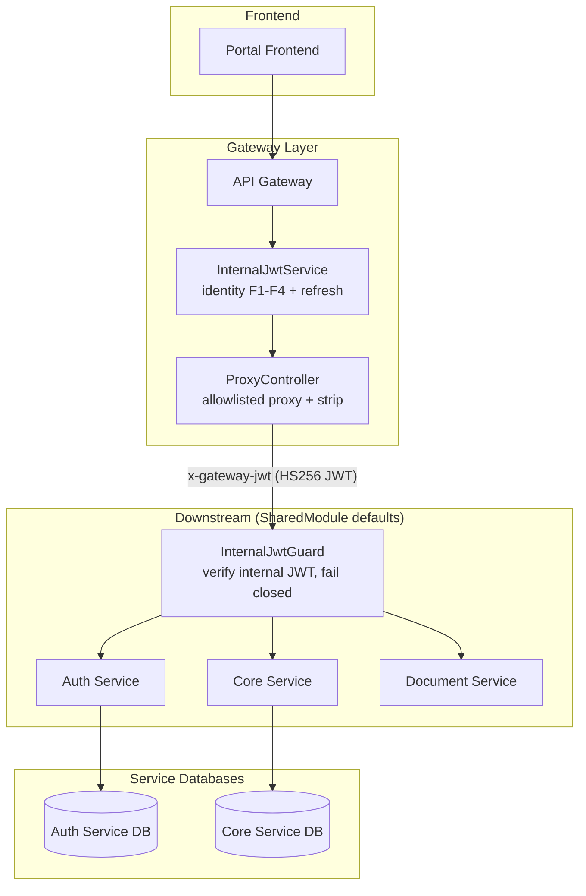
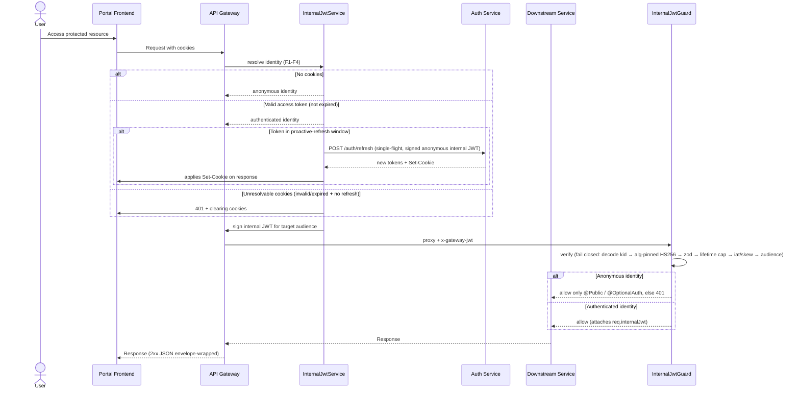
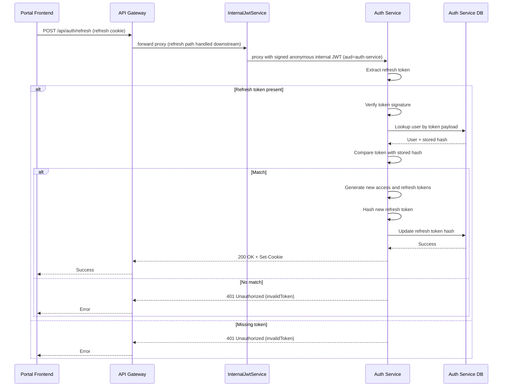

# Authentication and Authorization Architecture

> **Version**: v1.9 | **Date**: 2026-09-25
> **Related Docs**: [Route Authentication](./route_authentication.md)

## Overview

PawHaven uses a cookie-based JWT authentication system. The trust model is split at the gateway boundary:

- **Browser JWTs and cookies are handled ONLY by the API Gateway.** The gateway resolves the caller identity from the session cookies (`InternalJwtService`), verifies/refreshes the access token, and produces a short-lived **typed identity** per request.
- **The gateway signs the identity as a compact HS256 internal JWT** and forwards it to the target service in the `x-gateway-jwt` header (`kid` in the JOSE header).
- **Downstream services (auth-service / core-service / document-service) verify the signed internal JWT** with a global `InternalJwtGuard` (fail closed) and enforce endpoint policy with decorators. They never see browser JWTs and never trust forwarded user headers.
- Each microservice owns its own database (auth data lives in the Auth Service DB).

## System Components

- Portal Frontend: collects credentials, sends requests, keeps only user profile state.
- API Gateway: sole owner of browser JWT/cookies; resolves identity, refreshes tokens, signs and forwards the internal JWT; allowlisted reverse proxy.
- Auth Service: validates credentials, issues tokens, rotates refresh tokens; consumes the signed internal JWT.
- Domain Services (core/document): consume the signed internal JWT via the global guard + the `@InternalJwt()` param decorator.
- `@pawhaven/backend-core`: the internal-JWT concern is a single flat folder `dynamicModules/internalJwt/` — `InternalJwtGuard`, the `@InternalJwt()` decorator, JWT sign/verify (`jsonwebtoken@^9`), and `InternalJwtModule` (folded into `SharedModule` defaults, config-driven); the auth-mode annotations (`@Public`/`@OptionalAuth`, `auth-mode.decorator.ts`) stay in `decorators/`.

## Trust Model: Internal JWT

Downstream services do not receive `X-Auth-User-*` headers any more. They receive a typed, signed internal JWT:

| Header          | Content                                                                                                                        |
| --------------- | ------------------------------------------------------------------------------------------------------------------------------ |
| `x-gateway-jwt` | Compact HS256 internal JWT — JOSE header `{ alg: 'HS256', typ: 'JWT', kid: '<service>-v1' }`; payload = the typed claims below |
| `x-trace-id`    | Request id — carried as the claims `rid` (gateway generates one when absent)                                                   |

Claims payload (zod discriminated union in `packages/shared/types/internal-jwt.schema.ts`) — carried as the JWT claims:

```jsonc
// anonymous
{ "kind": "anonymous", "aud": "core-service", "iat": 1750000000, "exp": 1750000045, "rid": "<uuid>" }
// authenticated
{ "kind": "authenticated", "aud": "auth-service", "iat": 1750000000, "exp": 1750000045, "rid": "<uuid>", "sub": "u_123", "email": "a@b.c" }
```

- `aud` = the downstream audience = the service internal name (e.g. `auth-service`, `core-service`).
- All times are unix **seconds**; `iat + ttlSeconds` = `exp`. No `jti`.
- `sub`/`email`/`roles` exist only when `kind` is `authenticated` (`sub` = JWT `userId`).
- `jsonwebtoken` signs `header.payload` with the per-service secret, so the JOSE `kid` is cryptographically bound (it cannot be smuggled after verification). Verification is alg-pinned to `HS256`; a non-`HS256` token (or `alg: none`) is rejected as `bad-signature` by `jsonwebtoken`'s `algorithms` allowlist.

## System Architecture



> The gateway runs with `internalJwt.enabled: false` (it is the signer, never the enforcer). Downstream services set `enabled: true`, which registers the global `InternalJwtGuard` via `SharedModule.forRoot` defaults.

## Authentication Flows

### 1. Login

```mermaid
sequenceDiagram
    actor User
    participant Portal as Portal Frontend
    participant Gateway as API Gateway
    participant AuthService as Auth Service
    participant AuthDB as Auth Service DB

    User->>Portal: Enter credentials
    Portal->>Gateway: POST /api/auth/login

    Note over Gateway: no session cookies → resolves anonymous identity<br/>signs internal JWT for audience auth-service

    Gateway->>AuthService: proxy (signed anonymous internal JWT; @Public)
    AuthService->>AuthService: verify signed internal JWT, route is @Public
    AuthService->>AuthDB: Find user by email
    AuthDB-->>AuthService: User record
    AuthService->>AuthService: Verify password hash
    alt Invalid credentials
        AuthService-->>Gateway: 400 Bad Request
        Gateway-->>Portal: Error
        Portal-->>User: Show error
    else Valid credentials
        AuthService->>AuthService: Generate access and refresh tokens
        AuthService->>AuthService: Hash refresh token
        AuthService->>AuthDB: Store refresh token hash
        AuthDB-->>AuthService: Success
        AuthService-->>Gateway: 200 OK + Set-Cookie
        Gateway-->>Portal: Success
        Portal-->>User: Logged in
    end
```

**Details**

- Login issues access and refresh tokens and returns them as HTTP-only cookies.
- Refresh tokens are stored as hashes in the Auth Service database.
- Tokens are delivered via HTTP-only cookies; the frontend does not store raw tokens.
- `POST /auth/login`, `/register`, `/refresh` are `@Public()` in the auth-service (any verified internal-JWT kind allowed, including anonymous).

### 2. Protected Request (Gateway Identity Resolution → Internal JWT → Downstream Guard)



**Details**

- The gateway never forwards browser-supplied `x-auth-*` / `x-gateway-*` headers: the proxy strips all inbound headers with those prefixes (anti-spoofing).
- Downstream services verify exactly once, in the global guard. Inside handlers they inject the identity with the `@InternalJwt()` param decorator instead of touching the request; `InternalJwtRequest` and its `request.internalJwt` property are now internal to the guard and the decorator, not a controller-facing API.
- Endpoint policy is **downstream-only**: `@Public()`/`@OptionalAuth()` allow anonymous + authenticated; the default (no decorator) requires an authenticated identity.

### 3. Token Refresh



**Details**

- Refresh always issues a new access token. The refresh token is rotated **only when it is close to its own expiry** (default: ≤ 1 day remaining) — reusing it until then keeps the stored hash stable and avoids rotation races where in-flight requests carrying an already-rotated token get logged out prematurely.
- A refresh token is valid only if it matches the stored hash for that user.
- Refresh can be triggered explicitly (client call) or implicitly by the gateway `InternalJwtService` when the access token is within the proactive-refresh window.
- **Token type separation**: every token carries a `type` claim (`access`/`refresh`). The auth-service and the gateway reject tokens whose `type` does not match the expected kind.
- **Absolute session cap**: tokens carry `sessionStartedAt` + `sessionExpiresAt` (default: session start + 30 days). Refresh is rejected with `401 sessionExpired` once `now > sessionExpiresAt` — the user MUST log in again. Access tokens past `sessionExpiresAt` are rejected by the gateway `InternalJwtService` (with a 30s clock tolerance).
- **Refresh cookie Max-Age** = `min(7 days, remaining session time)`, so the refresh cookie never outlives the session.
- Responses from login/register/refresh include `session_expires_at` so clients can display session state.
- **Migration note**: tokens issued before this model lack the `type` claim and will be rejected — a one-time forced re-login on deploy is expected.

## Gateway Identity Resolution (InternalJwtService)

The gateway `InternalJwtService` (`apps/backend/gateway/src/internal-jwt/internal-jwt.service.ts`) resolves the caller identity per proxied request:

| Row       | Condition                                                            | Result                                                                                                                                                                                                           |
| --------- | -------------------------------------------------------------------- | ---------------------------------------------------------------------------------------------------------------------------------------------------------------------------------------------------------------- |
| F1        | No session cookies                                                   | anonymous identity                                                                                                                                                                                               |
| F2        | Valid access token (signature, `type: 'access'`, within session cap) | authenticated identity; on `/auth/logout` the request is forwarded so the auth-service can revoke the DB refresh token (the access token is not revoked server-side and stays valid until it expires)            |
| F3        | Access missing/expired but a refresh token exists                    | calls auth-service `/auth/refresh` (single-flight per refresh token, signed anonymous internal JWT with `aud=auth-service`); on success updates response + request cookies and returns an authenticated identity |
| F3-window | Valid access token inside the proactive-refresh window               | attempts a refresh without blocking the current access token; **a failed proactive refresh never downgrades a still-valid access token**                                                                         |
| F4        | Cookies unresolvable (invalid/expired and refresh fails/missing)     | clears auth cookies and returns 401 (never silent anonymous when the browser presents broken creds)                                                                                                              |

Refresh single-flight lives in the gateway only (in-memory per instance); on logout the gateway clears the auth cookies and forwards the request so the auth-service revokes the DB refresh token. Access tokens are not revoked server-side, so a logged-out access token stays valid until it expires (prod TTL 180s / 3 min; dev/test/uat 300s / 5 min).

## Downstream Enforcement (InternalJwtGuard)

The global guard (`packages/backend-core/dynamicModules/internalJwt/internal-jwt.guard.ts`) is registered through `InternalJwtModule`, which is part of the `SharedModule.forRoot` default modules and is config-driven:

- Service YAML `internalJwt.enabled: true` → `APP_GUARD InternalJwtGuard` is registered and construction validates the config fail-closed.
- `internalJwt.enabled` absent/`false` → no guard (the gateway itself runs this way).
- Missing/unreadable/invalid config fails closed at boot (`InternalJwtModule` throws) so a service can never boot without its intended auth posture.

Guard behavior:

1. Verify the JWT fail closed, in order: header present → `jwt.decode` (JOSE header) → `kid` allowlist (`trustedKeyIds`) + per-service secret → `jsonwebtoken.verify` alg-pinned `HS256` + exact `aud` + clock skew → zod `InternalJwtSchema` parse → lifetime cap (`exp - iat ≤ ttlSeconds`) → future-`iat` rejection. Any failure → 401.
2. Attach the verified claims to `request.internalJwt`.
3. `@Public()` or `@OptionalAuth()` → allow anonymous + authenticated.
4. Otherwise → authenticated identity required, else 401.

## Endpoint Policy (Downstream-Only)

| Service              | `@Public()`                            | `@OptionalAuth()`                                                                                                  | Default (authenticated)                                                                                              |
| -------------------- | -------------------------------------- | ------------------------------------------------------------------------------------------------------------------ | -------------------------------------------------------------------------------------------------------------------- |
| **auth-service**     | POST `/login`, `/register`, `/refresh` | —                                                                                                                  | POST `/logout`, GET `/me` (DB-backed)                                                                                |
| **core-service**     | —                                      | GET `/bootstrap`, `/home`, rescue list + `:id`, adoptable-pets list + `:id`, animal-follow status + follower count | all write routes (report-animal, rescue create, …), animal-follow follow/unfollow                                    |
| **document-service** | —                                      | —                                                                                                                  | `POST /pdf/render` only — internal, requires `kind:'authenticated'` JWT signed by core-v1 (`aud:'document-service'`) |

## Config Reference

Per-service YAML (`apps/backend/<svc>/src/config/{dev,test,uat,prod}/env/index.yaml`), with secrets as env placeholders (values live in `.env.example` / deployment env, never committed):

```yaml
# gateway (signer) — per enabled microService
microServices:
  - name: core-service
    options:
      internalJwt:
        keyId: core-v1 # core-v1 | auth-v1 | document-v1
        secret: ${INTERNAL_JWT_SECRET_CORE}
internalJwt:
  enabled: false
  ttlSeconds: 45 # 30..60
  clockSkewSeconds: 30
```

```yaml
# downstream service (verifier), e.g. core-service
internalJwt:
  enabled: true
  audience: core-service
  trustedKeyIds:
    - core-v1
  secret: ${INTERNAL_JWT_SECRET_CORE}
  ttlSeconds: 45
  clockSkewSeconds: 30
```

Env placeholders (gateway + one per downstream service): `INTERNAL_JWT_SECRET_CORE`, `INTERNAL_JWT_SECRET_AUTH`, `INTERNAL_JWT_SECRET_DOCUMENT`. Key ids: `core-v1`, `auth-v1`, `document-v1` (carried in the JOSE `kid` header; the per-service secrets are unchanged by the JWT switch — no rotation).

For the core→document internal JWT, core-service signs with `INTERNAL_JWT_PRIVATE_KEY_CORE` (`kid:'core-v1'`) and document-service verifies with `INTERNAL_JWT_PUBLIC_KEY_CORE`, trusting `core-v1` — asymmetric, so document-service holds only the public key. `INTERNAL_JWT_SECRET_DOCUMENT` is no longer used for this hop.

## Component Details

### API Gateway

- Single entry point for all client requests.
- Runs no Nest guard pipeline for auth: `InternalJwtService` resolves identity (F1-F4) before signing.
- Single allowlisted `ProxyController` (`@All('*path')`) proxies only configured prefix→service pairs: `/api/core → core-service`, `/api/auth → auth-service`. `document-service` is NOT proxied — it is core-only (see DD-10 in the System Architecture Overview). Unknown prefixes → 404.
- Proxy safety: strips all inbound `x-auth-*`/`x-gateway-*` headers, rejects `/internal`-after-rewrite and `..` paths, and envelope-wraps 2xx JSON responses only.
- Signs one `x-gateway-jwt` for every request (anonymous included) with the per-service secret/keyId from `microServices[].options.internalJwt` (`keyId` goes into the JOSE header).
- The prefix→service map and the internal-JWT keyId/secret are read from `microServices[]` in the gateway YAML. At runtime `MicroServiceRegistry` (`apps/backend/gateway/src/routing/micro-service.registry.ts`) resolves the target by gateway prefix. The gateway's config is validated by its Zod `Config.schema.ts` (composed from the shared building blocks, passed to `SharedModule.forRoot`); `bootstrapApp()` fails closed if any enabled service is missing its `internalJwt` keyId/secret or `internalJwt.ttlSeconds` is outside 30–60s. Routing lives in `src/routing/` (`RoutingModule`), while `src/config/` keeps only the per-environment YAML files. (The old `routing/gateway-config.validator.ts` was deleted — its rules were folded into `Config.schema.ts`.)
- CORS `methods`: `GET, POST, PUT, OPTIONS` (DELETE/PATCH removed).

### Auth Service

- Handles login, registration, refresh, and logout.
- Stores password hashes and refresh token hashes in its own database.
- Issues tokens and writes HTTP-only cookies in the response.
- Enforces the global `InternalJwtGuard`; `@Public()` on login/register/refresh; logout and `/me` inject `@InternalJwt() claims: AuthenticatedInternalJwt`. `/me` is DB-backed: it returns `getCurrentUser(claims.sub)` → `{ userId, email }` read from the user row, and 401s if the user is missing or soft-deleted.

### Domain Services (Core, Document, etc.)

- Run the global `InternalJwtGuard` (registered via `SharedModule` defaults when `internalJwt.enabled: true`).
- Handlers receive the verified identity (`sub`/`email`/`roles`) through the `@InternalJwt()` param decorator, never from request headers. `@OptionalAuth()` reads use `@InternalJwt({ allowAnonymous: true })` and get the full `InternalJwt` union; authenticated handlers annotate `AuthenticatedInternalJwt` when they need `claims.sub`.
- GET read endpoints use `@OptionalAuth()` (guest browsing); write endpoints are default-authenticated.
- **Do not verify browser JWTs** — they verify the gateway-signed internal JWT and trust the gateway for browser sessions.

### Service-to-Service Internal JWT (core-service → document-service)

document-service's one route (`POST /pdf/render`) is reached only by core-service over internal HTTP — the gateway does not proxy it, so there is no gateway-signed JWT in this hop. The trust model differs from the browser flows:

- core-service acts as the **signer** for this hop: it builds a complete `kind:'authenticated'` internal JWT with `aud:'document-service'`, `iat`/`exp`/`rid`/`sub`, signed with `INTERNAL_JWT_PRIVATE_KEY_CORE` and `kid:'core-v1'`.
- document-service trusts the `core-v1` **public** key (it holds only the public key, never core-service's signing secret). Its global `InternalJwtGuard` (registered via `SharedModule.forRoot`, `internalJwt.enabled: true`, `trustedKeyIds` including `core-v1`) verifies the token fail closed, applying the same `aud` + lifetime + zod checks as any downstream guard.
- The claims set is the same `AuthenticatedInternalJwt` union (`packages/shared/types/internal-jwt.schema.ts`); because `aud` is `document-service`, the exact-audience check passes only for this call.

> Note: this is a core-signed internal JWT, not a gateway-signed one. document-service is never the audience of a gateway proxy because the gateway no longer exposes a `/api/document` prefix (see DD-10 in the System Architecture Overview).

### Decorators (`packages/backend-core/decorators` + `dynamicModules/internalJwt/`)

- `@InternalJwt()` — parameter; injects the verified claims. It belongs to the internal-JWT concern and lives at `dynamicModules/internalJwt/internal-jwt.decorator.ts`, exported from `@pawhaven/backend-core/internal-jwt`. Default mode requires `kind === 'authenticated'`; a missing identity → 401 `E4005`. `@InternalJwt({ allowAnonymous: true })` returns claims for `@OptionalAuth()` routes too, anonymous kind included. The return is non-optional, so handlers write no null check. `InternalJwt` is both the decorator and the type (declaration merging), so one import covers `@InternalJwt() claims: InternalJwt`; handlers that need `sub` narrow to `AuthenticatedInternalJwt`.
- `@Public()` — method/class; any signed identity kind allowed. Exported from `@pawhaven/backend-core/decorators`.
- `@OptionalAuth()` — method/class; any signed identity kind allowed (handler can branch on `claims.kind`). Exported from `@pawhaven/backend-core/decorators`.

Endpoint-policy annotations stay in `decorators/` (`auth-mode.decorator.ts`) because `Public`/`OptionalAuth`/`AuthMetadataKey` are a distinct annotation concern; claims injection is imported from the internal-JWT subpath.

### InternalJwtGuard

See [Downstream Enforcement](#downstream-enforcement-internaljwtguard). Config-driven, fail closed, alg-pinned HS256 verification.

## Logout

- Logout (auth-service `POST /logout`, default-authenticated) revokes the DB refresh token by `claims.sub` and clears auth cookies.
- Access tokens are not revoked server-side: an already-issued access token stays valid until it expires. The revocation window therefore equals the access-token TTL — prod 180s (3 min), dev/test/uat 300s (5 min). Refresh revocation via the DB is unchanged.
- Clients should clear local user state and redirect to login.

## Security Considerations

- Use secure, HTTP-only cookies to prevent client-side access.
- Browser JWTs are handled in exactly one place (the gateway); downstream services receive only the short-lived signed internal JWT, which bounds replay (45s TTL).
- Store refresh tokens as hashes and rotate them when close to expiry (not on every refresh).
- Hash passwords using a strong one-way algorithm.
- Separate token types (`access` vs `refresh` claims) so a stolen access token cannot be replayed as a refresh token.
- Bound the refresh window with an **absolute session cap** (30 days by default): refresh tokens slide for at most 7 days, but the session ends unconditionally at `sessionExpiresAt`.
- Access-token revocation is bounded by the access-token TTL: prod 180s (3 min), dev/test/uat 300s (5 min). Logout revokes only the DB refresh token, so an already-issued access token stays valid until it expires (access tokens are never revoked server-side).
- Internal-JWT verification pins `HS256`, applies a small clock tolerance (30s) and an exact audience check; unknown `kid`s (JOSE header) are rejected (allowlist).
- Secrets must be kept in lockstep between the gateway and each downstream service (per-audience). Missing/invalid secrets fail closed at boot on both sides.
- CORS allows only `GET, POST, PUT, OPTIONS`; the proxy strips any inbound `x-auth-*`/`x-gateway-*` spoofing headers.
