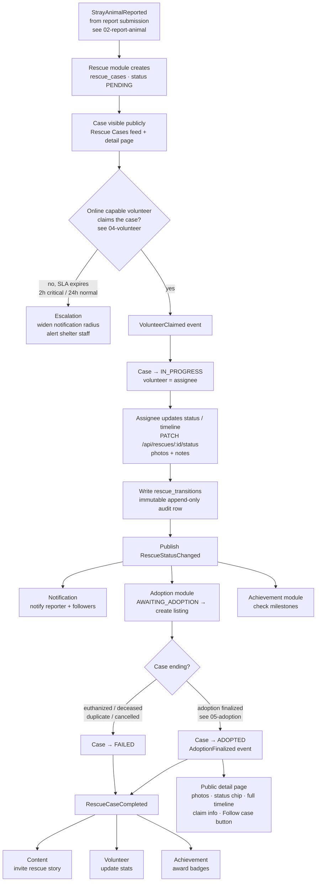

# Feature Workflow: Rescue Case Lifecycle

> **MVP Priority**: P0 · **Feature docs**: [README](./README.md) · **Status**: Blueprint
> **Sources**: [Product Blueprint §4–8](../PawHaven-Product-Strategy-EN.md) · [Backend Architecture §Rescue](../PawHaven-Backend-Architecture.md) · [System Architecture Overview §6 (Events)](../PawHaven-System-Architecture-Overview.md)

## 1. Overview

Every stray report becomes a **rescue case** that travels a status machine
`PENDING → IN_PROGRESS → TREATED → RECOVERING → AWAITING_ADOPTION → ADOPTED`
(with `FAILED`/`DUPLICATE`/`CANCELLED` as terminal side-states). The case is publicly
visible with a **timeline** so reporters, volunteers, and the public can track progress.

## 2. Actors & Roles

| Role          | Action                                                                  |
| ------------- | ----------------------------------------------------------------------- |
| Reporter      | Tracks the case, receives status notifications, can follow the case     |
| Volunteer     | Claims the case, moves it to IN_PROGRESS, updates medical/rescue status |
| Shelter staff | Manages AWAITING_ADOPTION cases, links to adoption listings             |
| Public        | Views case detail + timeline (read-only)                                |

## 3. End-to-End Flow

**Case created → Claimed → Progressed → Closed (adopted/failed)**



## 4. Frontend

- Feature modules: `Rescue` (case list/detail) + `Home` (feed/map cards).
- Case detail page: status chip, timeline, photo gallery, follow button, share link.
- Status colors match the design tokens in [Figma Design Spec §Rescue Cases](../figma-design-spec.md).
- Server-driven menu keys: `rescue.list`, `rescue.detail`.

## 5. Backend

- **Module**: Rescue (core-service).
- **Endpoints**:
  - `GET /api/rescues` (list with filters: status, species, radius/geo, pagination)
  - `GET /api/rescues/:id` (detail + timeline)
  - `PATCH /api/rescues/:id/status` (assignee/shelter only — status transitions)
  - `POST /api/rescues/:id/follow` / `DELETE .../follow` (registered users)
- **Events published**: `RescueCaseReported`, `RescueStatusChanged`, `RescueCaseCompleted`.
- **Events consumed**: `StrayAnimalReported` (create case), `VolunteerClaimed` (→ IN_PROGRESS),
  `AdoptionFinalized` (→ ADOPTED).

## 6. Data Model

- `rescue_cases` (Rescue): id, reportId, animal (denormalized from report), location (GeoJSON),
  status, assigneeId, shelterId, priority, timeline summary, timestamps.
- `rescue_transitions` (Rescue): caseId, fromStatus, toStatus, actorId, note, media[], createdAt
  — **immutable, append-only**.

## 7. State Machine / Rules

```
PENDING → IN_PROGRESS → TREATED → RECOVERING → AWAITING_ADOPTION → ADOPTED
   │           │           │           │              │
   └──────→ FAILED (terminal: duplicate / deceased / euthanized / cancelled)
```

- Only the assignee/shelter can transition status; transitions must be sequential
  (no skipping backwards except to FAILED).
- Escalation: a `PENDING` case unclaimed after the SLA (2h critical / 24h normal) escalates
  the notification radius (see [08-notifications](./08-notifications.md)).
- Every transition is persisted — the timeline is the audit trail.

## 8. Acceptance Criteria

- [ ] Report → case creation with status `PENDING` works end-to-end.
- [ ] Claim sets status to `IN_PROGRESS` and assigns the volunteer.
- [ ] Status updates persist transitions and emit `RescueStatusChanged`.
- [ ] Case detail page renders the full timeline with actors/timestamps.
- [ ] `AWAITING_ADOPTION` triggers creation of an adoption listing.
- [ ] Follow/unfollow works and followers receive status notifications.
- [ ] Escalation SLA updates the notification radius for stale `PENDING` cases.

## 9. Related Docs

- [Report a Stray Animal](./02-report-animal.md)
- [Volunteer Network & Case Claiming](./04-volunteer.md)
- [Adoption](./05-adoption.md)
- [Notifications](./08-notifications.md)
- [Profile & Achievements](./09-profile-achievements.md)
- [Backend Architecture §Rescue](../PawHaven-Backend-Architecture.md)
- [Product Blueprint §4–8](../PawHaven-Product-Strategy-EN.md)
