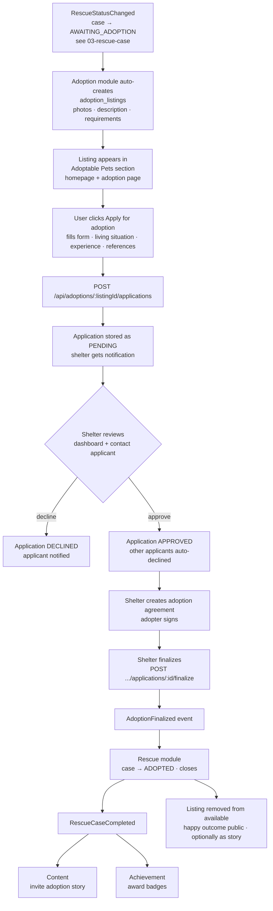

# Feature Workflow: Adoption

> **MVP Priority**: P1 · **Feature docs**: [README](./README.md) · **Status**: Blueprint
> **Sources**: [Product Blueprint §9 (Adoption)](../PawHaven-Product-Strategy-EN.md) · [Backend Architecture §Adoption](../PawHaven-Backend-Architecture.md) · [System Architecture Overview §6 (Events)](../PawHaven-System-Architecture-Overview.md)

## 1. Overview

When a rescue case reaches `AWAITING_ADOPTION`, the Adoption module creates an **adoption
listing**. The public can browse **Adoptable Pets**, submit **applications**, shelters
review applicants, and a finalized adoption transitions the case to `ADOPTED` and closes it.

## 2. Actors & Roles

| Role            | Action                                                                             |
| --------------- | ---------------------------------------------------------------------------------- |
| Public          | Browses adoptable pets, views listing detail                                       |
| Registered user | Submits an adoption application                                                    |
| Shelter staff   | Creates/edits listing, reviews applications, approves/declines, finalizes adoption |
| System          | Auto-creates listing from `AWAITING_ADOPTION` case, emits events                   |

## 3. End-to-End Flow

**Case ready → Listing published → Apply → Shelter reviews → Finalized → Case ADOPTED**

## 4. Frontend

- Feature modules: `Adoption` (listings + application flow) + `Home` (Adoptable Pets section).
- Listing cards, detail page with animal gallery + requirements, application form with validation.
- Shelter dashboard: applications list with approve/decline actions (admin/shelter route).
- Server-driven menu keys: `adoption.list`, `adoption.detail`, `adoption.apply`.

## 5. Backend

- **Module**: Adoption (core-service).
- **Endpoints**:
  - `GET /api/adoptions/listings` (public, filters: species, status, location)
  - `GET /api/adoptions/listings/:id`
  - `POST /api/adoptions/listings/:id/applications` (registered users)
  - `GET /api/adoptions/applications` (shelter: review queue)
  - `PATCH /api/adoptions/applications/:id` (approve/decline)
  - `POST /api/adoptions/applications/:id/agreement` (create agreement)
  - `POST /api/adoptions/applications/:id/finalize` (shelter finalizes adoption)
- **Events published**: `AdoptionFinalized`.
- **Events consumed**: `RescueStatusChanged` (→ create listing when `AWAITING_ADOPTION`).

## 6. Data Model

- `adoption_listings` (Adoption): id, caseId, title, description, photos, requirements,
  status (AVAILABLE/IN_REVIEW/FINALIZED), timestamps.
- `adoption_applications` (Adoption): listingId, applicantId, form answers, status
  (PENDING/APPROVED/DECLINED), reviewedBy, reviewedAt.
- `adoption_agreements` (Adoption): applicationId, terms, signatures, status.

## 7. State Machine / Rules

- Application: `PENDING → APPROVED | DECLINED` (only one approved per listing).
- Listing: `AVAILABLE → IN_REVIEW (after approval) → FINALIZED`.
- Only shelter staff can approve/finalize. Finalizing requires a signed agreement.
- Finalize emits `AdoptionFinalized`; Rescue owns the `ADOPTED` status change.

## 8. Acceptance Criteria

- [ ] `AWAITING_ADOPTION` case auto-creates a listing.
- [ ] Public can browse/filter adoptable pets.
- [ ] Registered users can submit applications; shelter sees review queue.
- [ ] Approval auto-declines other applicants; agreement flow works.
- [ ] Finalization transitions the case to `ADOPTED` and removes the listing from available.
- [ ] Story invitation + achievement awards fire on completion.

## 9. Related Docs

- [Rescue Case Lifecycle](./03-rescue-case.md)
- [Rescue Stories](./06-rescue-stories.md)
- [Profile & Achievements](./09-profile-achievements.md)
- [Backend Architecture §Adoption](../PawHaven-Backend-Architecture.md)
- [Product Blueprint §9 (Adoption)](../PawHaven-Product-Strategy-EN.md)
