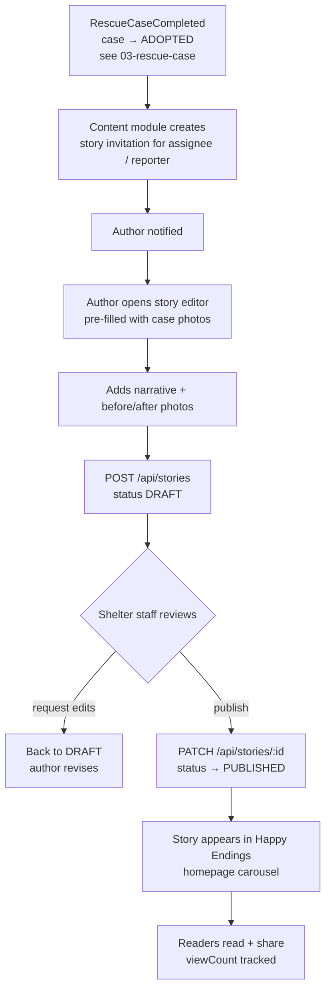

# Feature Workflow: Rescue Stories

> **MVP Priority**: P2 · **Feature docs**: [README](./README.md) · **Status**: Blueprint
> **Sources**: [Product Blueprint §9 (Endings)](../PawHaven-Product-Strategy-EN.md) · [Backend Architecture §Content](../PawHaven-Backend-Architecture.md) · [Figma Happy Endings](../figma-design-spec.md)

## 1. Overview

When a rescue case completes successfully (adopted), the Content module **invites** the
volunteer/reporter to write a **rescue story** ("Happy Ending"). Stories are public,
featured on the homepage carousel, and build community trust.

## 2. Actors & Roles

| Role                 | Action                                       |
| -------------------- | -------------------------------------------- |
| Volunteer / Reporter | Writes the story (before/after photos, text) |
| Shelter staff        | Publishes/curates stories, features them     |
| Public               | Reads stories, shares them                   |

## 3. End-to-End Flow

**Case completed → Invitation → Write story → Publish → Featured on homepage**

## 4. Frontend

- Feature module: `Content` (stories).
- Homepage **Happy Endings** carousel + story detail page.
- Story editor: title, narrative, photo upload, before/after toggle.
- Server-driven menu keys: `stories.list`, `stories.detail`, `stories.editor`.

## 5. Backend

- **Module**: Content (core-service).
- **Endpoints**:
  - `GET /api/stories` (public, featured first)
  - `GET /api/stories/:id`
  - `POST /api/stories` (author)
  - `PATCH /api/stories/:id` (shelter: publish/edit status)
- **Events consumed**: `RescueCaseCompleted` (create invitation), `AdoptionFinalized` (invite adoption story).

## 6. Data Model

- `stories` (Content): id, caseId, authorId, title, narrative, media[], status
  (DRAFT/IN_REVIEW/PUBLISHED), featured, viewCount, timestamps.

## 7. State Machine / Rules

- Story: `DRAFT → IN_REVIEW → PUBLISHED` (shelter approval gate).
- One primary story per case (additional community stories optional, later phase).
- Invitations expire gracefully — author can always start from "write story" manually.

## 8. Acceptance Criteria

- [ ] Completed case triggers a story invitation to the assignee.
- [ ] Author can create a story with before/after photos.
- [ ] Shelter review/publish flow works.
- [ ] Published stories appear in the Happy Endings carousel.
- [ ] Story detail page renders narrative + media and tracks views.

## 9. Related Docs

- [Rescue Case Lifecycle](./03-rescue-case.md)
- [Adoption](./05-adoption.md)
- [Knowledge Base](./07-knowledge-base.md)
- [Backend Architecture §Content](../PawHaven-Backend-Architecture.md)
- [Figma Design Spec §Happy Endings](../figma-design-spec.md)
