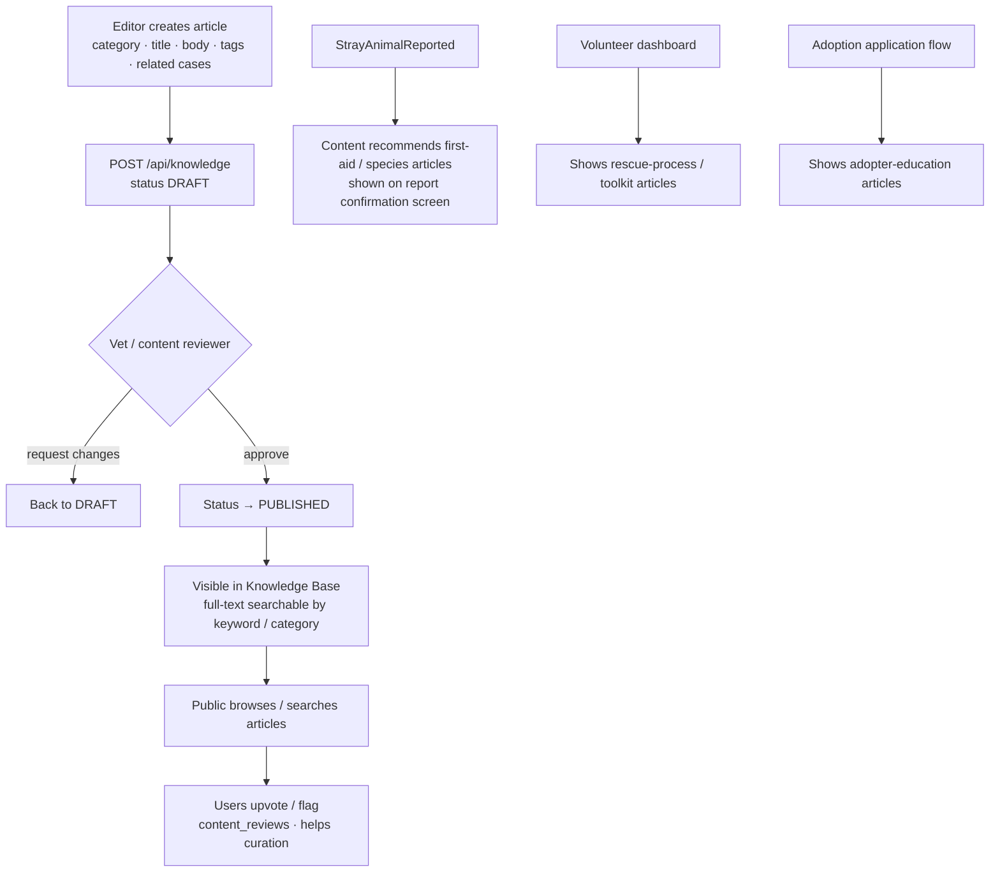

# Feature Workflow: Knowledge Base

> **MVP Priority**: P2 · **Feature docs**: [README](./README.md) · **Status**: Blueprint
> **Sources**: [Product Blueprint §10 (Knowledge Base)](../PawHaven-Product-Strategy-EN.md) · [Backend Architecture §Content](../PawHaven-Backend-Architecture.md) · [Figma Knowledge Base](../figma-design-spec.md)

## 1. Overview

A vet-reviewed library of articles (emergency care, species care, rescue process, adoption
guidance). Articles are publicly searchable and **contextually recommended** (after a
report is submitted, inside volunteer toolkits, and to adopters).

## 2. Actors & Roles

| Role                 | Action                                                    |
| -------------------- | --------------------------------------------------------- |
| Public               | Browses/search-reads articles                             |
| Content editor / vet | Writes and reviews articles                               |
| System               | Full-text search + contextual recommendation after events |

## 3. End-to-End Flow

**Write → Vet review → Publish → Searchable → Contextually recommended**

## 4. Frontend

- Feature module: `Content` (knowledge base).
- Knowledge Base page: category filter + search box; article detail with reading layout.
- Recommendation strip on report confirmation + volunteer dashboard.
- Server-driven menu keys: `knowledge.list`, `knowledge.detail`.

## 5. Backend

- **Module**: Content (core-service).
- **Endpoints**:
  - `GET /api/knowledge?search=&category=` (public)
  - `GET /api/knowledge/:id`
  - `POST /api/knowledge` (editor)
  - `PATCH /api/knowledge/:id` (review: status)
  - `POST /api/knowledge/:id/reviews` (upvote/flag)
- **Events consumed**: `StrayAnimalReported` (recommend articles to reporter).

## 6. Data Model

- `knowledge_articles` (Content): id, categoryId, title, body, tags[], status
  (DRAFT/IN_REVIEW/PUBLISHED), vetReviewed, relatedCaseIds, timestamps. Full-text index.
- `content_reviews` (Content): articleId, userId, rating, flag, createdAt.

## 7. State Machine / Rules

- Article: `DRAFT → IN_REVIEW → PUBLISHED` (vet gate).
- Only PUBLISHED articles are publicly visible/searchable.
- Recommendations are derived from category/species tags matched against report context.

## 8. Acceptance Criteria

- [ ] Editor can create articles; vet review/publish flow works.
- [ ] Full-text search returns published articles by keyword/category.
- [ ] Post-report confirmation shows relevant recommended articles.
- [ ] Volunteer dashboard and adoption flow surface contextual articles.
- [ ] Upvote/flag reviews are persisted.

## 9. Related Docs

- [Report a Stray Animal](./02-report-animal.md)
- [Rescue Stories](./06-rescue-stories.md)
- [Backend Architecture §Content](../PawHaven-Backend-Architecture.md)
- [Figma Design Spec §Knowledge Base](../figma-design-spec.md)
