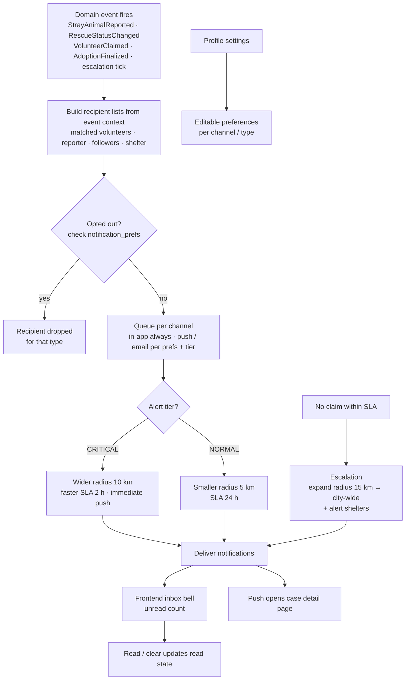

# Feature Workflow: Notifications

> **MVP Priority**: P0 · **Feature docs**: [README](./README.md) · **Status**: Blueprint
> **Sources**: [Product Blueprint §10 (Notifications)](../PawHaven-Product-Strategy-EN.md) · [Backend Architecture §Notification](../PawHaven-Backend-Architecture.md) · [System Architecture Overview §6 (Events)](../PawHaven-System-Architecture-Overview.md)

## 1. Overview

Event-driven notifications keep the loop closed: volunteers get **tiered push alerts** for
new cases, reporters/followers get status updates, shelters get application alerts. Users
control their **notification preferences** per channel (push, in-app, email).

## 2. Actors & Roles

| Role           | Receives                                                                  |
| -------------- | ------------------------------------------------------------------------- |
| Volunteer      | New case alerts near them (tiered by urgency/distance), escalation alerts |
| Reporter       | Case status changes, follow updates, case-completed                       |
| Case followers | Status changes on followed cases                                          |
| Shelter        | Adoption application submitted, escalation alerts                         |
| User (any)     | Configures notification_prefs per channel                                 |

## 3. End-to-End Flow

**Event happens → Notification module builds/queues → Deliver per prefs → Read/inbox**

## 4. Frontend

- Feature modules: `Profile` (preferences + inbox) + bell widget in nav.
- In-app notification list with unread badge; preference toggles per channel/type.
- Push registration (web push / device token).
- Server-driven menu key: `notifications.inbox`.

## 5. Backend

- **Module**: Notification (core-service).
- **Endpoints**:
  - `GET /api/notifications` (inbox, paginated)
  - `POST /api/notifications/:id/read` / `POST /api/notifications/read-all`
  - `GET/PATCH /api/notifications/prefs` (per channel/type)
  - `POST /api/notifications/register-token` (device push token)
- **Events consumed**: `StrayAnimalReported`, `RescueCaseReported`, `RescueStatusChanged`,
  `RescueCaseCompleted`, `VolunteerClaimed`, `AdoptionFinalized`.

## 6. Data Model

- `notifications` (Notification): userId, type, title, body, data (deep-link), channel,
  status (UNREAD/READ), createdAt. Indexed by (userId, read, createdAt).
- `notification_prefs` (Notification): userId, type, channels[] (push/in-app/email).

## 7. State Machine / Rules

- Preference rules: per-type opt-out is honored before any delivery; in-app is default-on.
- Tier rules: CRITICAL vs NORMAL derived from urgency assessment (see Report flow).
- Escalation is stateful per case (see [03-rescue-case](./03-rescue-case.md) SLA).

## 8. Acceptance Criteria

- [ ] Event → notification delivery works for each consumed event type.
- [ ] In-app inbox shows unread badge; read/unread and read-all work.
- [ ] Preference toggles actually suppress the corresponding channels/types.
- [ ] Volunteer alerts respect CRITICAL/NORMAL tiers and radius/SLA escalation.
- [ ] Push token registration + push delivery works (or is cleanly stubbed for MVP).

## 9. Related Docs

- [Report a Stray Animal](./02-report-animal.md)
- [Rescue Case Lifecycle](./03-rescue-case.md)
- [Volunteer Network & Case Claiming](./04-volunteer.md)
- [Adoption](./05-adoption.md)
- [Profile & Achievements](./09-profile-achievements.md)
- [Backend Architecture §Notification](../PawHaven-Backend-Architecture.md)
