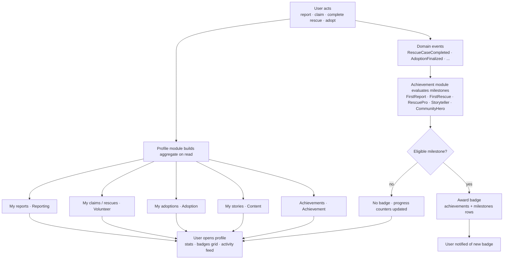

# Feature Workflow: Profile & Achievements

> **MVP Priority**: P1 · **Feature docs**: [README](./README.md) · **Status**: Blueprint
> **Sources**: [Product Blueprint §2, §10](../PawHaven-Product-Strategy-EN.md) · [Backend Architecture §Profile, §Achievement](../PawHaven-Backend-Architecture.md) · [System Architecture Overview §6 (Events)](../PawHaven-System-Architecture-Overview.md)

## 1. Overview

The profile aggregates a user's activity (reports, claims, rescues, adoptions, stories)
and **achievements** (badges/milestones) awarded automatically from domain events. It is
the read-side aggregation over module-owned collections — the Profile module never owns
write-side data.

## 2. Actors & Roles

| Role            | Action                                                              |
| --------------- | ------------------------------------------------------------------- |
| Registered user | Views own profile, activity feed, achievements                      |
| Public          | Views public volunteer profiles / rescuer reputation (limited)      |
| System          | Aggregates data across modules; Achievement awards badges on events |

## 3. End-to-End Flow

**User acts → Events fire → Achievement checks milestones → Profile aggregates → User views**

## 4. Frontend

- Feature modules: `Profile` (profile page, settings, inbox entry) + `Auth` (avatar/menu).
- Profile dashboard: stat cards, badges grid, activity timeline, settings tabs.
- Server-driven menu keys: `profile.dashboard`, `profile.settings`, `profile.achievements`.

## 5. Backend

- **Module**: Profile (aggregation) + Achievement (write-side).
- **Endpoints**:
  - `GET /api/profile/me` (aggregated dashboard)
  - `GET /api/profile/me/achievements`
  - `GET /api/profile/:userId` (public volunteer profile)
- **Events consumed**: `RescueCaseCompleted`, `AdoptionFinalized`, `StrayAnimalReported`,
  `VolunteerClaimed`, `RescueStatusChanged` (milestone checks).

## 6. Data Model

- `achievements` (Achievement): id, code, name, description, icon, tier.
- `milestones` (Achievement): userId, achievementId, progress, achievedAt, status.
- Profile is **read-only aggregation** — no dedicated profile collection (except user-owned
  settings/prefs owned by their modules).

## 7. State Machine / Rules

- Milestone rules are declarative (event → condition → badge) in the Achievement module.
- Badges are awarded once; progress counters persist across events.
- Profile read path always reflects the latest module state (no caching staleness beyond normal).

## 8. Acceptance Criteria

- [ ] Profile aggregates reports, claims, rescues, adoptions, stories, achievements.
- [ ] Achievement rules fire on the listed events and award badges once.
- [ ] Badges + progress visible on profile dashboard and notification on award.
- [ ] Public volunteer profile shows rescuer reputation (limited fields).
- [ ] Cross-module reads go through owning modules' public services (no direct DB).

## 9. Related Docs

- [Auth](./01-auth.md)
- [Report a Stray Animal](./02-report-animal.md)
- [Rescue Case Lifecycle](./03-rescue-case.md)
- [Volunteer Network & Case Claiming](./04-volunteer.md)
- [Adoption](./05-adoption.md)
- [Backend Architecture §Profile/§Achievement](../PawHaven-Backend-Architecture.md)
- [Product Blueprint §2, §10](../PawHaven-Product-Strategy-EN.md)
