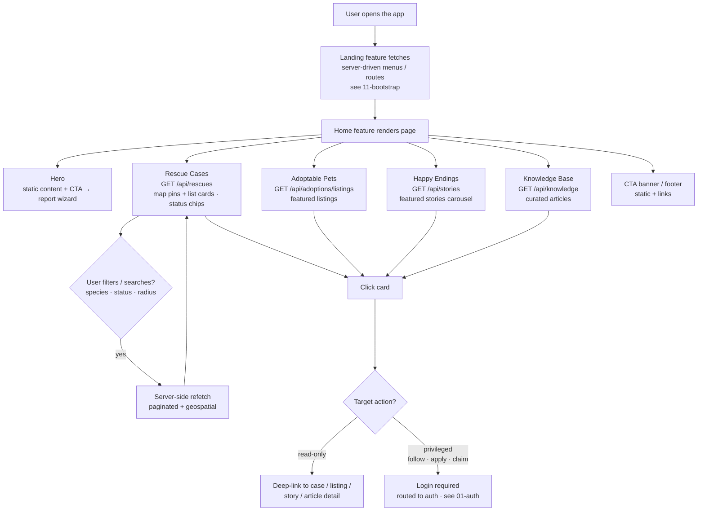

# Feature Workflow: Homepage & Discovery

> **MVP Priority**: P0 · **Feature docs**: [README](./README.md) · **Status**: Blueprint
> **Sources**: [Product Blueprint §3 (Discovery)](../PawHaven-Product-Strategy-EN.md) · [Frontend Architecture](../PawHaven-Frontend-Architecture.md) · [Figma Design Spec](../figma-design-spec.md)

## 1. Overview

The public-facing homepage is the discovery surface: hero + **Rescue Cases** (map/list),
**Adoptable Pets**, **Happy Endings**, **Knowledge Base**, CTA banner, footer. All sections
are read-only aggregations served to guests — this is the P0 first impression of the platform.

## 2. Actors & Roles

| Role            | Action                                                         |
| --------------- | -------------------------------------------------------------- |
| Guest / Public  | Browses all sections, reads case details, views adoptable pets |
| Registered user | As above + follows cases / applies for adoption (CTA paths)    |
| System          | Aggregates cross-module data for the sections                  |

## 3. End-to-End Flow

**Open homepage → Sections load → Filter/browse → Deep-link to actions**

## 4. Frontend

- Feature modules: `Landing` (bootstrap) + `Home` (page sections) + `Discovery` (filters/search).
- Component registry renders sections server-driven (see Bootstrap).
- Map widget + list layout with filter bar; skeleton loading; empty states per section.
- Server-driven menu keys: `home.rescue-cases`, `home.adoptable-pets`, `home.happy-endings`, `home.knowledge`.

## 5. Backend

- No new module — the homepage is a **read-only aggregation** over:
  - Rescue module: `GET /api/rescues` (list/map data)
  - Adoption module: `GET /api/adoptions/listings` (featured)
  - Content module: `GET /api/stories`, `GET /api/knowledge`
- Each request goes through the gateway; guest access is public (no auth required).

## 6. Data Model

- No homepage-owned collections. Data sources: `rescue_cases`, `adoption_listings`,
  `stories`, `knowledge_articles` (all owned by their modules).

## 7. State Machine / Rules

- Homepage reflects live data — no synthetic "featured" state beyond module-level flags
  (e.g. `featured` on stories/listings).
- Public reads must never leak private fields (reporter contact, volunteer phone) —
  read projections strip sensitive fields.

## 8. Acceptance Criteria

- [ ] All homepage sections render for guests without login.
- [ ] Rescue Cases map/list loads with correct status chips and geo pins.
- [ ] Filters (species/status/radius) and search work server-side.
- [ ] Adoptable Pets + Happy Endings + Knowledge sections load curated items.
- [ ] Deep links navigate to detail pages correctly.
- [ ] Sensitive fields are excluded from public projections.

## 9. Related Docs

- [Bootstrap & Server-Driven Routing](./11-bootstrap.md)
- [Rescue Case Lifecycle](./03-rescue-case.md)
- [Adoption](./05-adoption.md)
- [Rescue Stories](./06-rescue-stories.md)
- [Knowledge Base](./07-knowledge-base.md)
- [Frontend Architecture](../PawHaven-Frontend-Architecture.md)
- [Figma Design Spec](../figma-design-spec.md)
