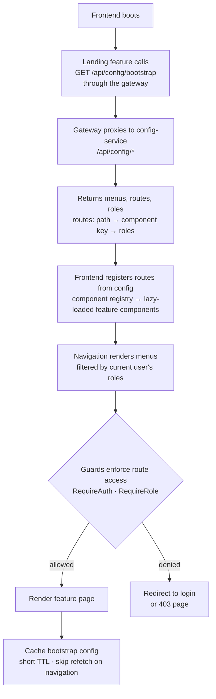

# Feature Workflow: Bootstrap & Server-Driven Routing

> **MVP Priority**: P0 · **Feature docs**: [README](./README.md) · **Status**: Blueprint
> **Sources**: [Frontend Architecture §Landing](../PawHaven-Frontend-Architecture.md) · [System Architecture Overview §4 (config-service), §5 (gateway)](../PawHaven-System-Architecture-Overview.md) · [Backend Architecture §Bootstrap](../PawHaven-Backend-Architecture.md)

## 1. Overview

PawHaven uses **server-driven configuration**: menus, routes, and roles are served from
`config-service`/Bootstrap module. The frontend fetches them at startup and renders
navigation/routes from config — new features ship by adding config entries without redeploying
the frontend routing tree.

## 2. Actors & Roles

| Role   | Action                                                                           |
| ------ | -------------------------------------------------------------------------------- |
| User   | Sees navigation/routes per role (guest vs. registered vs. volunteer vs. shelter) |
| Admin  | Edits menu/route/role config (bootstrap admin)                                   |
| System | Serves config; gateway proxies `/api/config/*` to config-service                 |

## 3. End-to-End Flow

**App boot → Fetch menus/routes → Register routes → Render nav → Role-filter**

## 4. Frontend

- Feature module: `Landing` (bootstrap orchestrator).
- Component registry: config `component` key → lazy React component.
- Role-based menu filtering + route guards (`RequireAuth`, `RequireRole`).
- Cache bootstrap config (short TTL) to avoid re-fetch on every navigation.

## 5. Backend

- **Service**: `config-service` (serves menus/routes/roles); core-service **Bootstrap module**
  owns the canonical `menus`, `routes`, `roles` collections.
- **Endpoints**:
  - `GET /api/config/bootstrap` (menus + routes + roles)
  - `GET /api/config/menus` / `GET /api/config/routes` (admin edit views)
  - `PATCH /api/config/*` (admin, later phase)
- Gateway route: `/api/config/* → config-service`.

## 6. Data Model

- `menus` (Bootstrap): key, label, icon, order, route, roles[].
- `routes` (Bootstrap): path, component, roles[], meta (title, layout).
- `roles` (Bootstrap): code, name, permissions[].

## 7. State Machine / Rules

- Route access: roles intersection (empty roles = public).
- Unknown component key → graceful fallback (404/placeholder) — never crash the app.
- Bootstrap config is versioned (schema evolution without breaking old clients).

## 8. Acceptance Criteria

- [ ] App renders nav + routes purely from bootstrap config.
- [ ] Role-based filtering hides unauthorized menus/routes.
- [ ] Guards block unauthorized access (redirect to login / 403).
- [ ] Unknown component keys render a fallback without crashing.
- [ ] Adding a new menu/route entry in config is enough to expose a new feature.

## 9. Related Docs

- [Auth](./01-auth.md)
- [Homepage & Discovery](./10-homepage-discovery.md)
- [Frontend Architecture](../PawHaven-Frontend-Architecture.md)
- [System Architecture Overview §4, §5](../PawHaven-System-Architecture-Overview.md)
