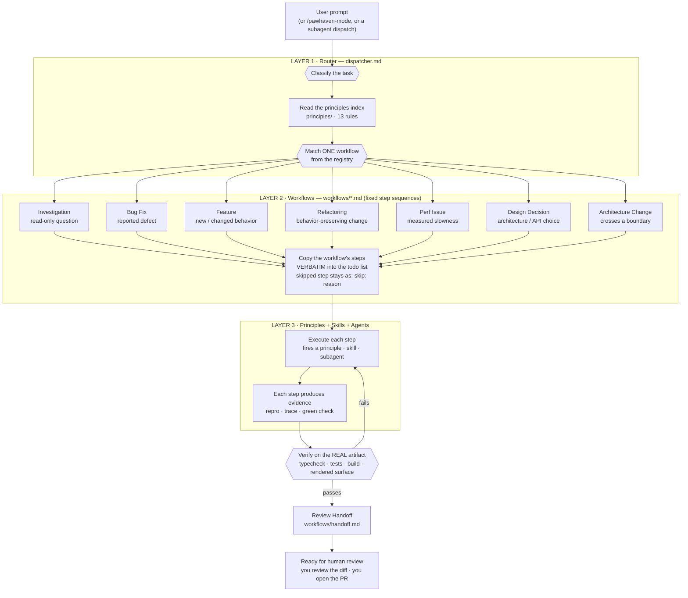
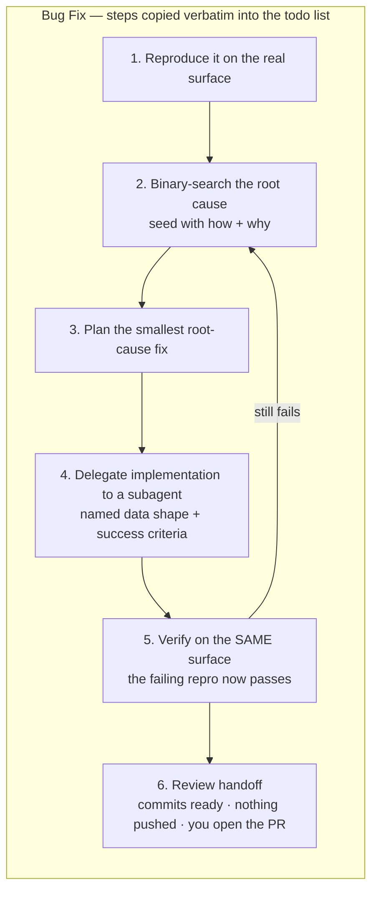
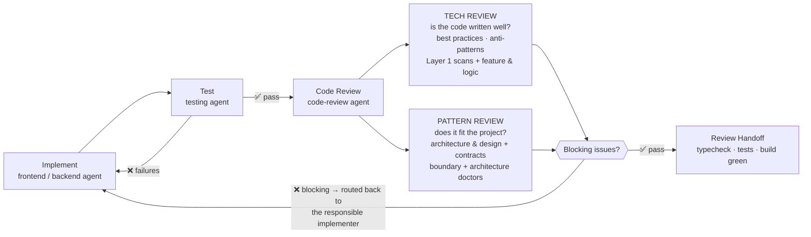

# Harness — PawHaven's Agent-Control Layer

> The agent-control layer for the PawHaven monorepo. It turns "generate code when asked" into a repeatable engineering process: classify the task, follow a fixed workflow, verify against the real artifact, ship.

Orientation for any agent or session entering this repository. Read this file first; load the rest on demand.

## 1. What this is and why it exists

`Harness` is PawHaven's agent-control layer: the markdown files (plus `settings.json`) that define how AI agents work on this repo — who they are, what rules they follow, and which workflow each task runs. Its core idea: **don't maximize code output — maximize verified engineering quality** ("write less, but higher quality code").

It holds: a router (`dispatcher.md`), workflows, principles, agents, rules, docs, and `settings.json`. The files do nothing on their own — CodeBuddy's agent runtime reads them and follows them.

For PawHaven specifically — a React 19 + TypeScript monorepo (`apps/`, `packages/`, `libs/`) with a design system, i18n in `zh-CN` / `en-US` / `de-DE`, and multiple engineering roles — the Harness keeps every agent and subagent on the same engineering discipline while each role stays scoped to its job.

## 2. How it's built (the layers)

### The three layers

Every task flows through the three layers end to end — nothing else in the repo runs:

Each layer, one line (executed in order):

1. **Step 1 — LAYER 1: Router (`dispatcher.md`)** — decides _which_ job this is. It never does the job; it picks the workflow and copies that workflow's steps into the todo list.
2. **Step 2 — LAYER 2: Workflows (`workflows/`)** — the fixed step sequences. They don't know _how_ to do anything either; each step just fires a skill or a subagent.
3. **Step 3 — LAYER 3: Principles + Skills + Agents** — the only layer that actually does work: principles decide, skills know the domain, agents execute and own the result.

### One workflow, zoomed in

All 8 workflows share this shape — numbered steps, each one firing layer-3, ending in a verification loop and the review handoff (`workflows/handoff.md`). Example: Bug Fix:

### The review is a loop (Tech Review + Pattern Review)

Code review is not a one-shot gate — it is a loop that only exits when both passes are clean:

Two verdicts, either can block: **Tech Review** asks "is the code written well" (best practices, anti-patterns, code quality); **Pattern Review** asks "does the change fit the project" (follows the project's overall development rules/patterns, fits the current architecture). A blocking finding routes back to the responsible implementer — `Step 1 Fix → Step 2 Retest → Step 3 Re-review` — until both verdicts pass.

### Folder map

| Folder                                  | Holds                    | Role in the system                                                                                                                                                               |
| --------------------------------------- | ------------------------ | -------------------------------------------------------------------------------------------------------------------------------------------------------------------------------- |
| [`dispatcher.md`](./dispatcher.md)      | The router skill         | The router. Classifies tasks, holds the non-negotiables, the 13-principle index, autonomy policy, subagent defaults, reply rules, workflow registry.                             |
| [`workflows/`](./workflows/README.md)   | 8 fixed step sequences   | The plans. Copied verbatim into the todo list, executed step by step.                                                                                                            |
| [`principles/`](./principles/README.md) | 13 leaf skills           | Decision rules. Read in full when applied; a citation must trace to a choice it changed.                                                                                         |
| [`agents/`](./agents/README.md)         | Role definitions         | Who does what (main-agent, architect, frontend, backend, code-review, ...). Each has scope and escalation.                                                                       |
| [`skills/`](./skills/README.md)         | Skill folders            | Domain knowledge (react, styling, i18n, code-review doctors). Triggered by `description` in frontmatter.                                                                         |
| [`rules/`](./rules/README.md)           | Always-on constraints    | Repo facts: architecture, security, testing, documentation, git.                                                                                                                 |
| [`docs/`](./docs/README.md)             | Shared reference         | Product strategy, system architecture, design spec, agent-communication protocol, task-log format, standards.                                                                    |
| `task-log.md` (runtime, git-ignored)    | Single task progress log | One temporary runtime file at the Harness root, appended per task and per stage. The next stage references it; a stalled task is traced through it; cleared on the user's "Yes". |

Each folder ships a `README.md` — read the folder README before diving into the files inside.

## 3. How it works (prompt → result)

Every task, regardless of entry point (user prompt, `/pawhaven-mode`, or a dispatched subagent), runs the same 6-step process:

1. **Open the todo list.** First item in every multi-step task: _read the Principles section in full_. Non-negotiable.
2. **Match a workflow.** Classify the task against the workflow set (Section 4) and pick one.
3. **Copy workflow steps verbatim into todos.** This happens _before_ any task-specific reasoning. A step you skip stays in the list as `skip: <reason>`. Silently dropping named steps is the primary failure mode this guards against.
4. **Execute each step**, firing skills and subagents. Each step produces evidence (a repro, a trace, a green check).
5. **Name the principles.** Every reply names each principle that shaped a decision and the specific choice it changed.
6. **Write the reply** per the mode skill's reply rules: short declarative sentences, impact framed for consumer + maintainer, failing-then-passing output pasted verbatim.

### Concrete example

"the search page takes 2 seconds to render, find out why and fix it"

1. Task matched to the **perf-issue** workflow.
2. Workflow steps land in the todo list: Step 1 baseline → Step 2 trace → Step 3 optimize → Step 4 re-measure.
3. Baseline trace captured on the real surface (devtools, profiler).
4. Profiling points at a re-render cascade; the domain-model principle moves the state to its right home.
5. Re-measure on the same surface: the before/after numbers prove the win.
6. Reply reports the numbers verbatim, the root cause, and the regression guard.

### Key mechanics

- **Verbatim-todo discipline** — workflow steps land in the todo list word-for-word. Each workflow ends in an evidence-gated feedback loop: Step 1 failing repro → Step 2 pass (bug-fix), Step 1 pinned behavior → Step 2 still green (refactoring), Step 1 baseline trace → Step 2 post-fix trace (perf).
- **Verification is the religion** — _prove-it-works_: verify against the real artifact (typecheck, tests, build, rendered surface), never against "it compiles".
- **Task log (single runtime file)** — all progress goes to `Harness/task-log.md` (git-ignored, format: `docs/task-log.md`). The orchestrator appends a `## Task:` section per task and a digest after every stage; the next stage references it, and a stalled task is traced through it (Step 1 Stuck Log → Step 2 last Phase → Step 3 Handoff). When a task completes, the orchestrator asks **"是否需要清空运行log？"** — Yes → clear, No → keep.
- **Review is two passes** — Tech Review (best practices, anti-patterns) and Pattern Review (fits the project's patterns and architecture). Two verdicts, either can block; blocking findings loop back to the implementer.
- **Subagent discipline** — every subagent routes through the shared agent type (`main-agent.md`) so it inherits the same methodology; the parent owns every subagent's work, reviews the diff itself, and writes its own summary.
- **Principles are decision-forcing** — laziness protocol (bias to delete), subtract-before-you-add, model-the-domain, prove-it-works, never-block-on-the-human, migrate-callers-then-delete-legacy.
- **Never block on the human** — if the answer is observable by running something, prototype it instead of asking; reserve questions for genuine product or preference calls.

## 4. The workflows (each flow: from where → does what → ends with)

### Catalog

| Workflow            | Entry (trigger)                          | Core flow (in order)                                                                    | Exit (result)                            |
| ------------------- | ---------------------------------------- | --------------------------------------------------------------------------------------- | ---------------------------------------- |
| Investigation       | how/why/are-we-sure question             | 1. read the real code → 2. run what's runnable → 3. cite evidence                       | cited answer, no code change             |
| Bug Fix             | reported defect                          | 1. reproduce → 2. root-cause → 3. fix → 4. verify on the same surface                   | PR + failing-then-passing evidence       |
| Feature             | new or changed behavior                  | 1. data shape → 2. design explore → 3. checkpoint → 4. implement → 5. verify all states | PR + cross-state verification            |
| Refactoring         | behavior-preserving structure change     | 1. pin behavior → 2. subtract → 3. move in units → 4. pin stays green                   | PR + green pin                           |
| Perf Issue          | measured slowness                        | 1. baseline → 2. trace → 3. optimize → 4. re-measure                                    | PR + before/after numbers                |
| Design Decision     | architecture / data-model / API choice   | 1. model domain → 2. enumerate options → 3. observe forks → 4. decide + tradeoff        | decision + docs record                   |
| Architecture Change | crosses a component/package/API boundary | 1. parallel design → 2. migration wave → 3. verify boundary                             | PR + boundary verification + docs record |
| Review Handoff      | end of most other workflows              | 1. ordered commits → 2. typecheck · tests · build green → 3. handoff summary → 4. stop  | verified diff, PR opened by you          |

### Per-workflow detail

The catalog above is the one-line summary — for the full steps and evidence gates, open the workflow's own file in [`workflows/`](./workflows/README.md) (one file per workflow). This README only points; the workflow files are the detail.

## 5. Load order (recommended)

1. **This file** — orientation.
2. **`docs/agent-communication-protocol.md`** — the structured output formats every agent uses to interoperate.
3. **`docs/task-log.md`** — the single runtime progress file (`Harness/task-log.md`): what each stage produced, and where to look when a task stalls.
4. **`docs/README.md`** — the documentation index (product strategy, architecture, design spec) for domain context.
5. **The folder READMEs** — `workflows/` · `principles/` · `agents/` · `skills/` · `rules/` (each directory ships one; read it before the files inside). The router (`dispatcher.md`) lives at the root, introduced in Section 2 and indexed in Section 7.
6. **`rules/`** — the always-on constraints for the current task.
7. **The relevant agent + skill** — only what the task needs (progressive disclosure).

## 6. Skill contract (Anthropic Agent Skills model)

Every skill is a folder containing `SKILL.MD`:

- **Frontmatter** (`name`, `description`, `version`) — `description` is also the trigger: what it does AND when to use it.
- **Body** — purpose, core rules, examples.
- **`references/`** — bulky lookup material (best-practices, decision trees, forbidden patterns). Loaded on demand, not every time.

Skills cross-reference each other via a `## Related` section. Do not duplicate a sibling skill's content — link to it.

## 7. Skill index

### Mode (`dispatcher.md`)

The router: `dispatcher.md` holds the non-negotiables, the 13-principle index, autonomy policy, subagent defaults, reply rules, and the workflow registry. The shared methodology every agent and subagent inherits. The mode's non-negotiables override workflow details when they conflict — they are the floor no workflow may go below.

### Principles (`principles/`)

`laziness-protocol` · `subtract-before-you-add` · `experience-first` · `outcome-oriented-execution` · `model-the-domain` · `boundary-discipline` · `make-operations-idempotent` · `migrate-callers-then-delete-legacy-apis` · `prove-it-works` · `fix-root-causes` · `sequence-verifiable-units` · `guard-the-context-window` · `never-block-on-the-human`.

### Code review (`skills/code-review/`)

Entry point: `SKILL.MD` (orchestrator). Two passes, two verdicts:

- **TECH REVIEW** — is the code written well? `figma-doctor` gate + `typecheck-doctor` · `react-doctor` · `style-doctor` · `i18n-doctor` · `backend-doctor` + Layer 3 feature & logic deep review (best practices, anti-patterns, code quality).
- **PATTERN REVIEW** — does the change fit the project? `boundary-doctor` · `architecture-doctor` + Layer 2 architecture & design + Layer 4 type contract deep review (follows the project's overall development rules/patterns, fits the current architecture).

The review is adversarial: attempt to break the change before confirming it, every `MUST FIX` backed by evidence, no silent polishing. Either pass can block the handoff independently; blocking findings loop back to the responsible implementer.

### Frontend (`skills/frontend/`)

`react` · `styling` · `i18n` · `component` · `redux` · `react-query` · `react-hook-form`.
Each links to its `references/best-practices.md`.

## 8. Golden rules

- Keep state local; server state → TanStack Query, client state → Redux, forms → React Hook Form.
- All styles via `@pawhaven/design-system` tokens — no hardcoded colors, no magic numbers.
- All user-visible text via `t()` in `zh-CN` / `en-US` / `de-DE`.
- Components graduate to a package only when 2+ features use them.
- Communicate in the structured formats from the communication protocol.
- Follow the glossary — one term, one meaning, across the whole system.
