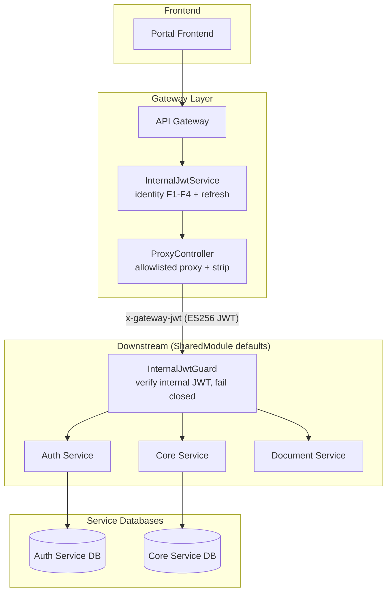
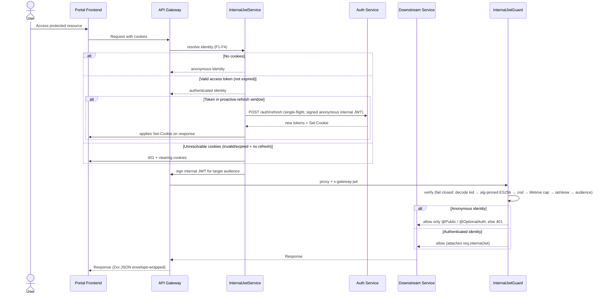
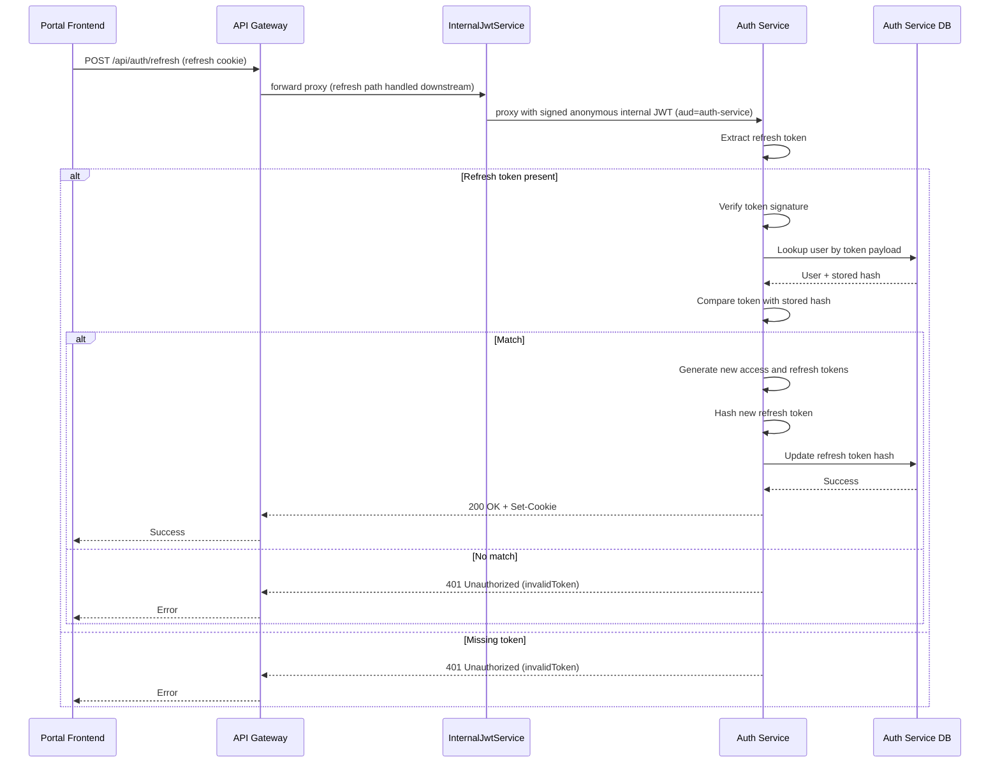

# Authentication and Authorization Architecture

> **Version**: v1.9 | **Date**: 2026-09-25
> **Related Docs**: [Route Authentication](route_authentication.md)

## Overview

PawHaven uses a cookie-based JWT authentication system. The trust model is split at the gateway boundary:

- **Browser JWTs and cookies are handled ONLY by the API Gateway.** The gateway resolves the caller identity from the session cookies (`InternalJwtService`), verifies/refreshes the access token, and produces a short-lived **typed identity** per request.
- **The gateway signs the identity as a compact ES256 internal JWT** and forwards it to the target service in the `x-gateway-jwt` header (`kid` in the JOSE header).
- **Downstream services (auth-service / core-service / document-service) verify the signed internal JWT** with a global `InternalJwtGuard` (fail closed) and enforce endpoint policy with decorators. They never see browser JWTs and never trust forwarded user headers.
- Each microservice owns its own database (auth data lives in the Auth Service DB).

## System Components

- Portal Frontend: collects credentials, sends requests, keeps only user profile state.
- API Gateway: sole owner of browser JWT/cookies; resolves identity, refreshes tokens, signs and forwards the internal JWT; allowlisted reverse proxy.
- Auth Service: validates credentials, issues tokens, rotates refresh tokens; consumes the signed internal JWT.
- Domain Services (core/document): consume the signed internal JWT via the global guard + the `@InternalJwt()` param decorator.
- `@pawhaven/backend-core`: the internal-JWT concern is a single flat folder `dynamicModules/internalJwt/` — `InternalJwtGuard`, the `@InternalJwt()` decorator, JWT sign/verify (`jsonwebtoken@^9`), and `InternalJwtModule` (folded into `SharedModule` defaults, config-driven); the auth-mode annotations (`@Public`/`@OptionalAuth`, `auth-mode.decorator.ts`) stay in `decorators/`.

## Trust Model: Internal JWT

Downstream services do not receive `X-Auth-User-*` headers any more. They receive a typed, signed internal JWT:

| Header          | Content                                                                                                                       |
| --------------- | ----------------------------------------------------------------------------------------------------------------------------- |
| `x-gateway-jwt` | Compact ES256 internal JWT — JOSE header `{ alg: 'ES256', typ: 'JWT', kid: 'internal-v1' }`; payload = the typed claims below |
| `x-trace-id`    | Request id — carried as the claims `rid` (gateway generates one when absent)                                                  |

Claims payload (zod discriminated union in `packages/backend-core/types/InternalJwt.schema.ts`) — carried as the JWT claims:

```jsonc
// anonymous
{ "kind": "anonymous", "aud": "core-service", "iat": 1750000000, "exp": 1750000045, "rid": "<uuid>" }
// authenticated
{ "kind": "authenticated", "aud": "auth-service", "iat": 1750000000, "exp": 1750000045, "rid": "<uuid>", "sub": "u_123", "email": "a@b.c" }
```

- `aud` = the downstream audience = the service internal name (e.g. `auth-service`, `core-service`).
- All times are unix **seconds**; `iat + ttlSeconds` = `exp`. No `jti`.
- `sub`/`email`/`roles` exist only when `kind` is `authenticated` (`sub` = JWT `userId`).
- `jsonwebtoken` signs `header.payload` with the gateway's PEM **private** key (`INTERNAL_JWT_PRIVATE_KEY`), so the JOSE `kid` is cryptographically bound — it cannot be smuggled after verification. Verification is alg-pinned to `ES256` against the PEM **public** key looked up by `kid` (`publicKeys[kid]`); a token carrying another `alg` (or `alg: none`) is rejected as `bad-signature` by `jsonwebtoken`'s `algorithms` allowlist.
- **One key pair serves every hop.** The gateway holds the private key; each downstream service holds the public key under the same `kid`, `internal-v1` (`${INTERNAL_JWT_PUBLIC_KEY}`, identical in all three). What differs per service is `aud`, not the key.

## System Architecture



> The gateway runs with `internalJwt.enabled: false` (it is the signer, never the enforcer). Downstream services set `enabled: true`, which registers the global `InternalJwtGuard` via `SharedModule.forRoot` defaults.

## Authentication Flows

### 1. Login

```mermaid
sequenceDiagram
    actor User
    participant Portal as Portal Frontend
    participant Gateway as API Gateway
    participant AuthService as Auth Service
    participant AuthDB as Auth Service DB

    User->>Portal: Enter credentials
    Portal->>Gateway: POST /api/auth/login

    Note over Gateway: no session cookies → resolves anonymous identity<br/>signs internal JWT for audience auth-service

    Gateway->>AuthService: proxy (signed anonymous internal JWT; @Public)
    AuthService->>AuthService: verify signed internal JWT, route is @Public
    AuthService->>AuthDB: Find user by email
    AuthDB-->>AuthService: User record
    AuthService->>AuthService: Verify password hash
    alt Invalid credentials
        AuthService-->>Gateway: 400 Bad Request
        Gateway-->>Portal: Error
        Portal-->>User: Show error
    else Valid credentials
        AuthService->>AuthService: Generate access and refresh tokens
        AuthService->>AuthService: Hash refresh token
        AuthService->>AuthDB: Store refresh token hash
        AuthDB-->>AuthService: Success
        AuthService-->>Gateway: 200 OK + Set-Cookie
        Gateway-->>Portal: Success
        Portal-->>User: Logged in
    end
```

**Details**

- Login issues access and refresh tokens and returns them as HTTP-only cookies.
- Refresh tokens are stored as hashes in the Auth Service database.
- Tokens are delivered via HTTP-only cookies; the frontend does not store raw tokens.
- `POST /auth/login`, `/register`, `/refresh` are `@Public()` in the auth-service (any verified internal-JWT kind allowed, including anonymous).

### 2. Protected Request (Gateway Identity Resolution → Internal JWT → Downstream Guard)



**Details**

- The gateway never forwards browser-supplied `x-auth-*` / `x-gateway-*` headers: the proxy strips all inbound headers with those prefixes (anti-spoofing).
- Downstream services verify exactly once, in the global guard. Inside handlers they inject the identity with the `@InternalJwt()` param decorator instead of touching the request; `InternalJwtRequest` and its `request.internalJwt` property are now internal to the guard and the decorator, not a controller-facing API.
- Endpoint policy is **downstream-only**: `@Public()`/`@OptionalAuth()` allow anonymous + authenticated; the default (no decorator) requires an authenticated identity.

### 3. Token Refresh



**Details**

- Refresh always issues a new access token. The refresh token is rotated **only when it is close to its own expiry** (default: ≤ 1 day remaining) — reusing it until then keeps the stored hash stable and avoids rotation races where in-flight requests carrying an already-rotated token get logged out prematurely.
- A refresh token is valid only if it matches the stored hash for that user.
- Refresh can be triggered explicitly (client call) or implicitly by the gateway `InternalJwtService` when the access token is within the proactive-refresh window.
- **Token type separation**: every token carries a `type` claim (`access`/`refresh`). The auth-service and the gateway reject tokens whose `type` does not match the expected kind.
- **Absolute session cap**: tokens carry `sessionStartedAt` + `sessionExpiresAt` (default: session start + 30 days). Refresh is rejected with `401 sessionExpired` once `now > sessionExpiresAt` — the user MUST log in again. Access tokens past `sessionExpiresAt` are rejected by the gateway `InternalJwtService` (with a 30s clock tolerance).
- **Refresh cookie Max-Age** = `min(7 days, remaining session time)`, so the refresh cookie never outlives the session.
- Responses from login/register/refresh include `session_expires_at` so clients can display session state.
- **Migration note**: tokens issued before this model lack the `type` claim and will be rejected — a one-time forced re-login on deploy is expected.

## Gateway Identity Resolution (InternalJwtService)

The gateway `InternalJwtService` (`apps/backend/gateway/src/internal-jwt/internal-jwt.service.ts`) resolves the caller identity per proxied request:

| Row       | Condition                                                            | Result                                                                                                                                                                                                           |
| --------- | -------------------------------------------------------------------- | ---------------------------------------------------------------------------------------------------------------------------------------------------------------------------------------------------------------- |
| F1        | No session cookies                                                   | anonymous identity                                                                                                                                                                                               |
| F2        | Valid access token (signature, `type: 'access'`, within session cap) | authenticated identity; on `/auth/logout` the request is forwarded so the auth-service can revoke the DB refresh token (the access token is not revoked server-side and stays valid until it expires)            |
| F3        | Access missing/expired but a refresh token exists                    | calls auth-service `/auth/refresh` (single-flight per refresh token, signed anonymous internal JWT with `aud=auth-service`); on success updates response + request cookies and returns an authenticated identity |
| F3-window | Valid access token inside the proactive-refresh window               | attempts a refresh without blocking the current access token; **a failed proactive refresh never downgrades a still-valid access token**                                                                         |
| F4        | Cookies unresolvable (invalid/expired and refresh fails/missing)     | clears auth cookies and returns 401 (never silent anonymous when the browser presents broken creds)                                                                                                              |

Refresh single-flight lives in the gateway only (in-memory per instance); on logout the gateway clears the auth cookies and forwards the request so the auth-service revokes the DB refresh token. Access tokens are not revoked server-side, so a logged-out access token stays valid until it expires (prod TTL 180s / 3 min; dev/test/uat 300s / 5 min).

## Downstream Enforcement (InternalJwtGuard)

The global guard (`packages/backend-core/dynamicModules/internalJwt/internal-jwt.guard.ts`) is registered through `InternalJwtModule`, which is part of the `SharedModule.forRoot` default modules and is config-driven:

- Service YAML `internalJwt.enabled: true` → `APP_GUARD InternalJwtGuard` is registered and construction validates the config fail-closed.
- `internalJwt.enabled` absent/`false` → no guard (the gateway itself runs this way).
- Missing/unreadable/invalid config fails closed at boot (`InternalJwtModule` throws) so a service can never boot without its intended auth posture.

Guard behavior:

1. Verify the JWT fail closed, in order: header present → `jwt.decode` (JOSE header) → `kid` present in the configured `publicKeys` map (an unknown `kid` → `unknown-key`) → `jsonwebtoken.verify` against that PEM public key, alg-pinned `ES256` + exact `aud` + clock skew → zod `InternalJwtSchema` parse → lifetime cap (`exp - iat ≤ ttlSeconds`) → future-`iat` rejection. Any failure → 401.
2. Attach the verified claims to `request.internalJwt`.
3. `@Public()` or `@OptionalAuth()` → allow anonymous + authenticated.
4. Otherwise → authenticated identity required, else 401.

## Endpoint Policy (Downstream-Only)

| Service              | `@Public()`                            | `@OptionalAuth()`                                                                                                  | Default (authenticated)                                                                                         |
| -------------------- | -------------------------------------- | ------------------------------------------------------------------------------------------------------------------ | --------------------------------------------------------------------------------------------------------------- |
| **auth-service**     | POST `/login`, `/register`, `/refresh` | —                                                                                                                  | POST `/logout`, GET `/me` (DB-backed)                                                                           |
| **core-service**     | —                                      | GET `/bootstrap`, `/home`, rescue list + `:id`, adoptable-pets list + `:id`, animal-follow status + follower count | all write routes (report-animal, rescue create, …), animal-follow follow/unfollow                               |
| **document-service** | —                                      | —                                                                                                                  | `POST /internal/pdf/render` only — requires a `kind:'authenticated'` internal JWT with `aud:'document-service'` |

## Config Reference

Per-service JSON (`apps/backend/<svc>/src/config/{dev,test,uat,prod}/env/index.json`). Key material stays out of those files: `${...}` placeholders resolve from `.env*` and `process.env`, which the config module merges underneath `index.json`.

```jsonc
// gateway — the signer.
// Schema: requiredInternalJwtSigningSchema — keyId and privateKey are required.
{
  "internalJwt": {
    "enabled": false, // false: the gateway signs, it never verifies
    "audience": "gateway",
    "ttlSeconds": 45, // must be 30..60
    "clockSkewSeconds": 30,
    "keyId": "internal-v1",
    "privateKey": "${INTERNAL_JWT_PRIVATE_KEY}",
  },
  "microServices": [
    {
      "name": "core-service",
      "enable": true,
      "options": {
        "host": "${CORE_SERVICE_HOST}",
        "port": 8081,
        "gatewayPrefix": "/api/core",
        "pathRewrite": "/core-service",
      },
    },
  ],
}
```

```jsonc
// downstream verifier — auth-service and document-service.
// Schema: requiredInternalJwtVerifyingSchema — publicKeys must be non-empty.
{
  "internalJwt": {
    "enabled": true,
    "audience": "auth-service",
    "publicKeys": { "internal-v1": "${INTERNAL_JWT_PUBLIC_KEY}" },
    "ttlSeconds": 45,
    "clockSkewSeconds": 30,
  },
}
```

core-service carries the same block plus `"keyId": "internal-v1"`, because it also signs outbound calls; its schema refines `keyId` + `audience` on top of `internalJwtConfigSchema`.

Env placeholders are exactly two: `INTERNAL_JWT_PRIVATE_KEY` (gateway — and any service that makes signed outbound calls) and `INTERNAL_JWT_PUBLIC_KEY` (all three downstream services, same value everywhere). There is **one** key id, `internal-v1`, carried in the JOSE `kid` header. Services do not each have their own key, and `microServices[].options` holds only `host` / `port` / `gatewayPrefix` / `pathRewrite` — no `internalJwt` there.

## Component Details

### API Gateway

- Single entry point for all client requests.
- Runs no Nest guard pipeline for auth: `InternalJwtService` resolves identity (F1-F4) before signing.
- Single allowlisted `ProxyController` (`@All('*path')`) resolves the target from the **first two path segments** (`SERVICE_PREFIX_SEGMENTS = 2`) and proxies the three configured pairs: `/api/core → core-service`, `/api/auth → auth-service`, `/api/document → document-service`. An unknown prefix → 404.
- Proxy safety: strips all inbound `x-auth-*`/`x-gateway-*` headers, rejects `/internal`-after-rewrite and `..` paths, and envelope-wraps 2xx JSON responses only.
- Signs one `x-gateway-jwt` for every request (anonymous included) from the top-level `internalJwt` block — `privateKey` signs, `keyId` goes into the JOSE header. `microServices[]` carries no `internalJwt` key.
- The prefix→service map comes from `microServices[]`; the key material sits in the sibling top-level `internalJwt` block. At runtime `MicroServiceRegistry` (`apps/backend/gateway/src/routing/microService.registry.ts`) resolves the target by the two-segment gateway prefix. `app.module.ts` passes `gatewayConfigSchema` to `ConfigsModule.forRoot`, which runs `validateConfig` inside the config factory — so a block missing `keyId`/`privateKey`, or with `ttlSeconds` outside 30–60, throws during module init and the service never boots. Routing lives in `src/routing/` (`routing.module.ts`); `src/config/` holds one `index.json` per environment.
- CORS `methods`: `GET, POST, PUT, OPTIONS` (DELETE/PATCH removed).

### Auth Service

- Handles login, registration, refresh, and logout.
- Stores password hashes and refresh token hashes in its own database.
- Issues tokens and writes HTTP-only cookies in the response.
- Enforces the global `InternalJwtGuard`; `@Public()` on login/register/refresh; logout and `/me` inject `@InternalJwt() claims: AuthenticatedInternalJwt`. `/me` is DB-backed: it returns `getCurrentUser(claims.sub)` → `{ userId, email }` read from the user row, and 401s if the user is missing or soft-deleted.

### Domain Services (Core, Document, etc.)

- Run the global `InternalJwtGuard` (registered via `SharedModule` defaults when `internalJwt.enabled: true`).
- Handlers receive the verified identity (`sub`/`email`/`roles`) through the `@InternalJwt()` param decorator, never from request headers. `@OptionalAuth()` reads use `@InternalJwt({ allowAnonymous: true })` and get the full `InternalJwt` union; authenticated handlers annotate `AuthenticatedInternalJwt` when they need `claims.sub`.
- GET read endpoints use `@OptionalAuth()` (guest browsing); write endpoints are default-authenticated.
- **Do not verify browser JWTs** — they verify the gateway-signed internal JWT and trust the gateway for browser sessions.

### Service-to-Service Internal JWT (core-service → document-service)

The flow that exercises this is guide-PDF rendering: `GuideService` calls document-service's `POST /internal/pdf/render` **directly over HTTP** (`HttpClientService.create(microServiceNames.DOCUMENT)` → `http://<host>:8083/document-service/internal/pdf/render`, matching document-service's `http.prefix`). No gateway sits on that path, so this JWT is signed by core-service rather than by the gateway.

- **Signer** — the shared `HttpClientService` (`packages/backend-core/dynamic-modules/http-client/httpClientInstance.ts`) builds `kind:'authenticated'`, `aud` = the callee (`document-service`), `sub` = the caller's `serviceName`, `rid` = the trace id, and `iat`/`exp` from `internalJwt.ttlSeconds`. It signs with `INTERNAL_JWT_PRIVATE_KEY` and `internalJwt.keyId`. If `INTERNAL_JWT_PRIVATE_KEY` is unset it attaches **no** JWT, and the callee's guard rejects the call.
- **Verifier** — document-service's global `InternalJwtGuard` (`internalJwt.enabled: true`, validated by `requiredInternalJwtVerifyingSchema`) looks the JOSE `kid` up in `publicKeys`, pins `ES256`, and applies the same exact-`aud` + lifetime + zod + clock-skew checks as any downstream guard. Its `audience` is `document-service`, so the audience check passes only for this call.
- The claims type is the same `InternalJwt` discriminated union (`packages/backend-core/types/InternalJwt.schema.ts`).

The path prefix is not what makes this hop private: document-service **is** in the gateway's proxy allowlist (`/api/document → /document-service`), and the proxy's `/internal` guard only fires when the _rewritten_ path starts with `/internal` — which a non-empty `pathRewrite` prevents, so `/api/document/internal/pdf/render` rewrites to `/document-service/internal/pdf/render` and passes. The guide flow stays off the gateway because `HttpClientService` targets the callee's host and port directly, not because the gateway forbids it. Endpoint policy is what bounds it: `InternalPdfController.render` is default-authenticated, so it still needs an authenticated internal JWT.

### Decorators (`packages/backend-core/decorators` + `dynamicModules/internalJwt/`)

- `@InternalJwt()` — parameter; injects the verified claims. It belongs to the internal-JWT concern and lives at `dynamicModules/internalJwt/internal-jwt.decorator.ts`, exported from `@pawhaven/backend-core/internal-jwt`. Default mode requires `kind === 'authenticated'`; a missing identity → 401 `E4005`. `@InternalJwt({ allowAnonymous: true })` returns claims for `@OptionalAuth()` routes too, anonymous kind included. The return is non-optional, so handlers write no null check. `InternalJwt` is both the decorator and the type (declaration merging), so one import covers `@InternalJwt() claims: InternalJwt`; handlers that need `sub` narrow to `AuthenticatedInternalJwt`.
- `@Public()` — method/class; any signed identity kind allowed. Exported from `@pawhaven/backend-core/decorators`.
- `@OptionalAuth()` — method/class; any signed identity kind allowed (handler can branch on `claims.kind`). Exported from `@pawhaven/backend-core/decorators`.

Endpoint-policy annotations stay in `decorators/` (`auth-mode.decorator.ts`) because `Public`/`OptionalAuth`/`AuthMetadataKey` are a distinct annotation concern; claims injection is imported from the internal-JWT subpath.

### InternalJwtGuard

See [Downstream Enforcement](#downstream-enforcement-internaljwtguard). Config-driven, fail closed, alg-pinned ES256 verification.

## Logout

- Logout (auth-service `POST /logout`, default-authenticated) revokes the DB refresh token by `claims.sub` and clears auth cookies.
- Access tokens are not revoked server-side: an already-issued access token stays valid until it expires. The revocation window therefore equals the access-token TTL — prod 180s (3 min), dev/test/uat 300s (5 min). Refresh revocation via the DB is unchanged.
- Clients should clear local user state and redirect to login.

## Security Considerations

- Use secure, HTTP-only cookies to prevent client-side access.
- Browser JWTs are handled in exactly one place (the gateway); downstream services receive only the short-lived signed internal JWT, which bounds replay (45s TTL).
- Store refresh tokens as hashes and rotate them when close to expiry (not on every refresh).
- Hash passwords using a strong one-way algorithm.
- Separate token types (`access` vs `refresh` claims) so a stolen access token cannot be replayed as a refresh token.
- Bound the refresh window with an **absolute session cap** (30 days by default): refresh tokens slide for at most 7 days, but the session ends unconditionally at `sessionExpiresAt`.
- Access-token revocation is bounded by the access-token TTL: prod 180s (3 min), dev/test/uat 300s (5 min). Logout revokes only the DB refresh token, so an already-issued access token stays valid until it expires (access tokens are never revoked server-side).
- Internal-JWT verification pins `ES256`, applies a small clock tolerance (30s) and an exact audience check; unknown `kid`s (JOSE header) are rejected (no matching entry in `publicKeys`).
- The internal-JWT key pair must match across the boundary: the gateway's private key and each downstream service's public key, both under `kid` `internal-v1`. Each service's configured `aud` must equal its own name. Missing/invalid keys or audience fail closed at boot on both sides.
- CORS allows only `GET, POST, PUT, OPTIONS`; the proxy strips any inbound `x-auth-*`/`x-gateway-*` spoofing headers.
