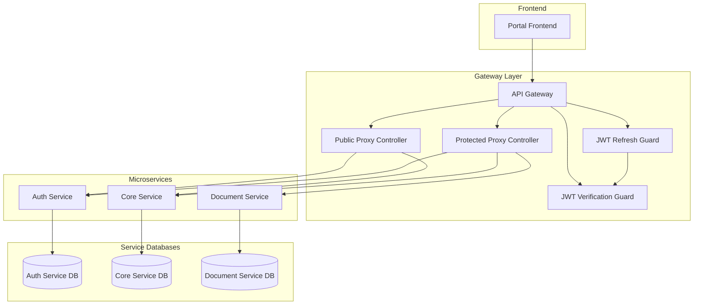
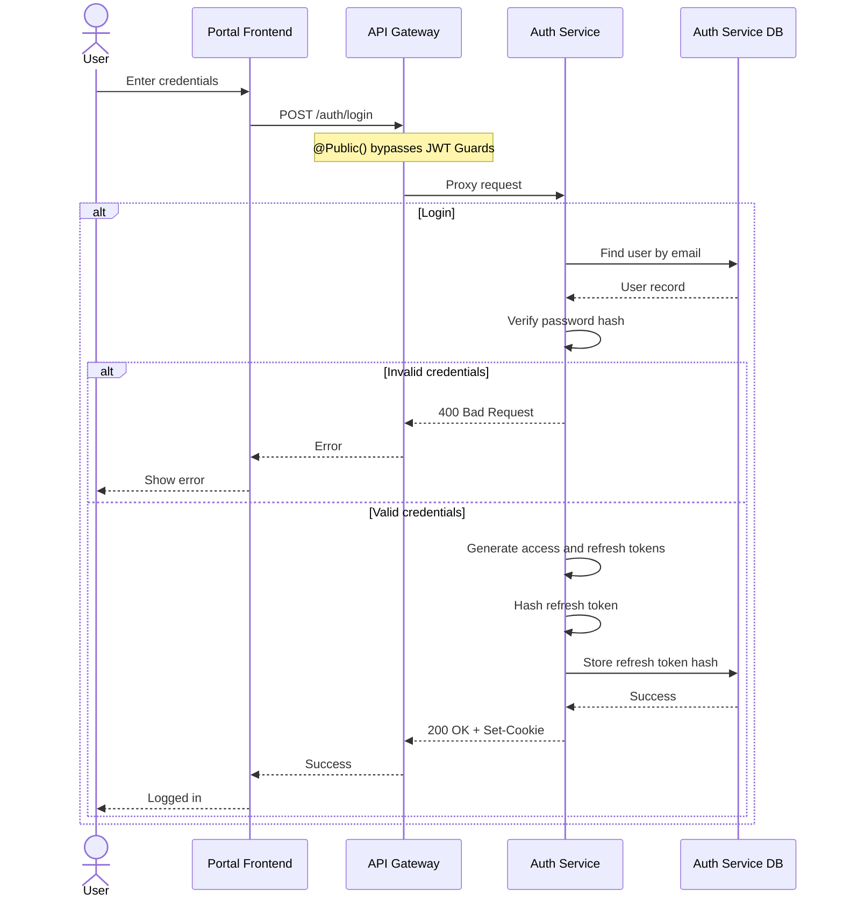
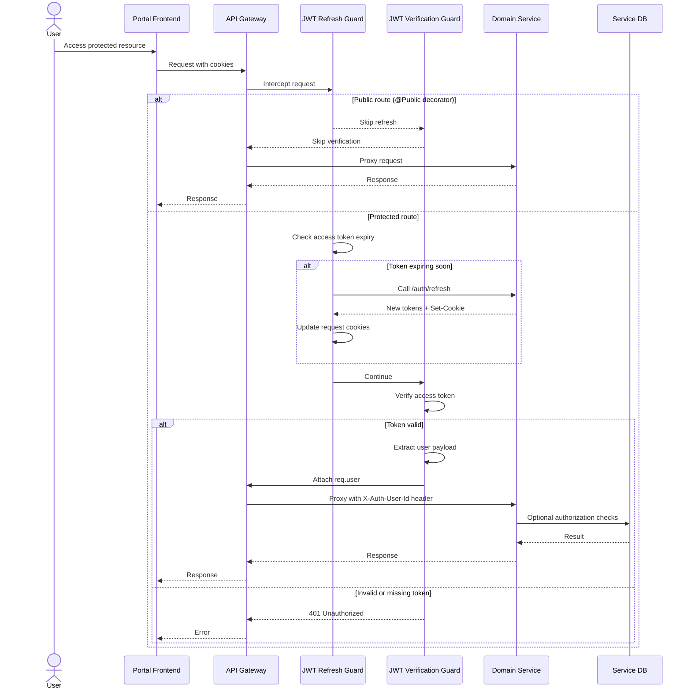
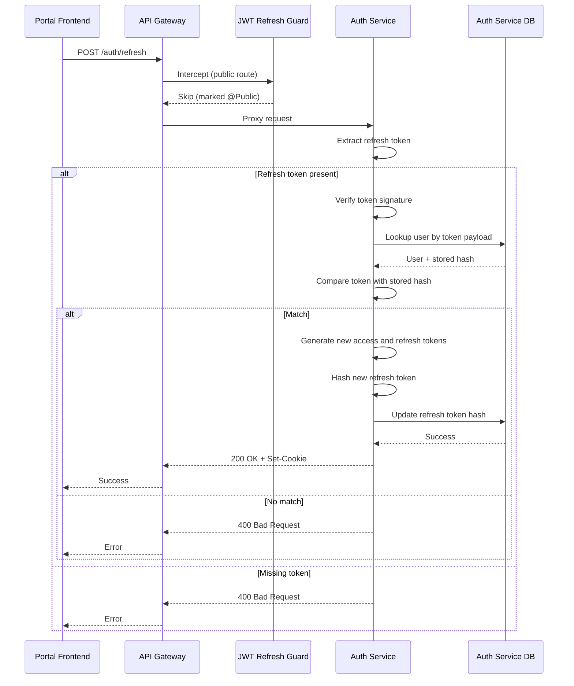

# Authentication and Authorization Architecture

## Overview

PawHaven uses a cookie-based JWT authentication system across multiple microservices. The flow is centered around:

- API Gateway with JWT Guards handling authentication and token refresh
- Public routes explicitly declared in gateway controllers
- Auth Service handling login, registration, refresh, and logout
- Microservices trust gateway-forwarded user headers (no JWT validation)
- Each microservice owning its own database (auth data lives in the Auth Service DB)

## System Components

- Portal Frontend: collects credentials, sends requests, and keeps only user profile state
- API Gateway: central entry point with JWT Guards for authentication and auto-refresh
- Auth Service: validates credentials, issues tokens, rotates refresh tokens
- Domain Services: core/document/etc; receive authenticated requests with user headers from gateway
- No shared auth infrastructure needed in services (gateway handles all authentication)

## System Architecture

## Authentication Flows

### 1. Login

**Details**

- Login issues access and refresh tokens and returns them as HTTP-only cookies.
- Refresh tokens are stored as hashes in the Auth Service database.
- Tokens are delivered via HTTP-only cookies; frontend does not store raw tokens.

### 2. Token Verification (Protected Requests)

**Details**

- Gateway enforces authentication with two sequential guards:
  - `JwtRefreshGuard`: Proactively refreshes tokens before expiry
  - `JwtVerificationGuard`: Validates access token and attaches user to request
- `@Public()` decorator marks controllers/routes that bypass both guards
- Public routes are explicitly declared in `PublicProxyController` (e.g., POST /auth/login)
- Protected routes use catch-all pattern `/:service/*path` in `ProtectedProxyController`
- Gateway forwards authenticated user info via `X-Auth-User-Id` and `X-Auth-User-Email` headers
- **Microservices trust gateway headers and do not perform JWT validation**
- Services use forwarded headers for business logic and authorization decisions

### 3. Token Refresh

**Details**

- Refresh rotates both access and refresh tokens.
- A refresh token is valid only if it matches the stored hash for that user.
- Refresh can be triggered explicitly (client call) or implicitly (JwtRefreshGuard).

**JwtRefreshGuard behavior**

- Runs before JwtVerificationGuard on all protected requests
- Checks if access token is missing, invalid, or expiring soon (configurable window)
- Automatically calls auth-service `/refresh` endpoint with refresh token
- On success: updates both response Set-Cookie headers and request cookies for current request
- On failure: clears cookies only when no valid access token exists; otherwise preserves current token
- Skips refresh logic entirely for routes marked with `@Public()` decorator

## Component Details

### API Gateway

- Acts as a single entry point for all client requests
- Enforces authentication via global JWT guards (refresh + verification)
- Public routes explicitly declared in `PublicProxyController`:
  - `POST /auth/login`
  - `POST /auth/register`
  - `POST /auth/refresh`
  - `GET /core/app/bootstrap`
- Protected routes handled by `ProtectedProxyController` with catch-all pattern
- Forwards requests to microservices with user info in custom headers (`X-Auth-User-Id`, `X-Auth-User-Email`)
- Automatically refreshes tokens before expiry via `JwtRefreshGuard`

### Auth Service

- Handles login, registration, refresh, and logout
- Stores password hashes and refresh token hashes in its own database
- Issues tokens and writes HTTP-only cookies in the response
- Does not validate JWT for its own endpoints (trusts gateway authentication)
- Receives `X-Auth-User-Id` header from gateway for protected endpoints like logout

### Domain Services (Core, Document, etc.)

- Receive pre-authenticated requests from gateway
- Extract user information from `X-Auth-User-Id` and `X-Auth-User-Email` headers
- **Do not perform JWT validation** - trust gateway's authentication
- Focus on business logic and domain-specific authorization
- Use forwarded user context for database queries and access control

### Public Decorator (Gateway)

- Gateway-level `@Public()` decorator marks controllers/routes that bypass authentication
- Applied at class or method level using NestJS Reflector metadata
- Checked by both `JwtRefreshGuard` and `JwtVerificationGuard`
- Example: `PublicProxyController` has class-level `@Public()` for all auth endpoints

### JWT Guards (Gateway)

**JwtRefreshGuard** (runs first):

- Proactively refreshes access tokens before expiry
- Configurable refresh window (default: 20% of token lifetime)
- Calls auth-service refresh endpoint internally
- Updates cookies on both response and request objects

**JwtVerificationGuard** (runs second):

- Validates access token JWT signature
- Extracts user payload (userId, email)
- Attaches `req.user` object for downstream proxy service
- Throws 401 Unauthorized if token is missing or invalid

## Logout

- Logout clears auth cookies and invalidates refresh token state in the Auth Service database.
- Clients should clear local user state and redirect to login.

## Security Considerations

- Use secure, HTTP-only cookies to prevent client-side access.
- Store refresh tokens as hashes and rotate on each refresh.
- Hash passwords using a strong one-way algorithm.
- Avoid leaking sensitive details in error responses and logs.
