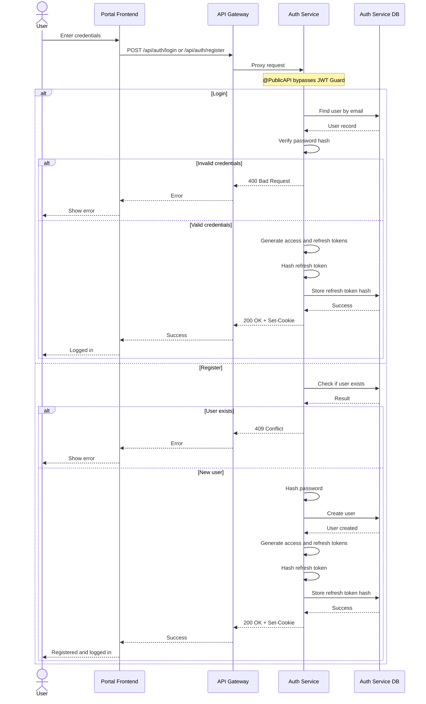
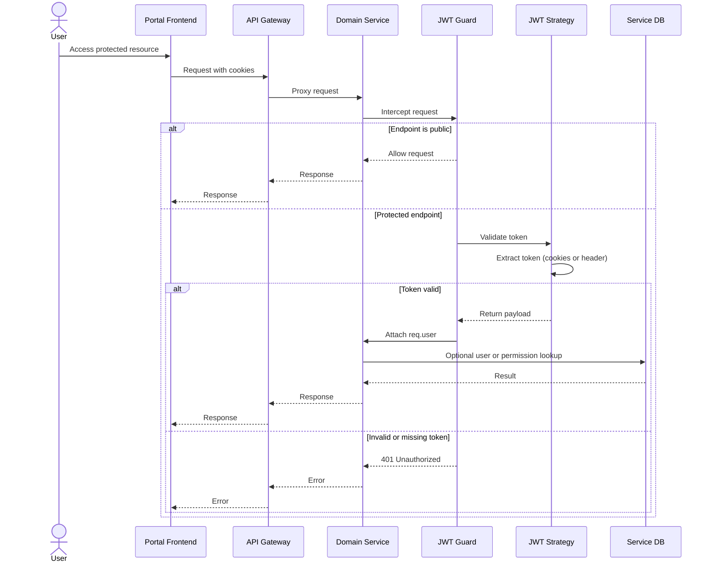
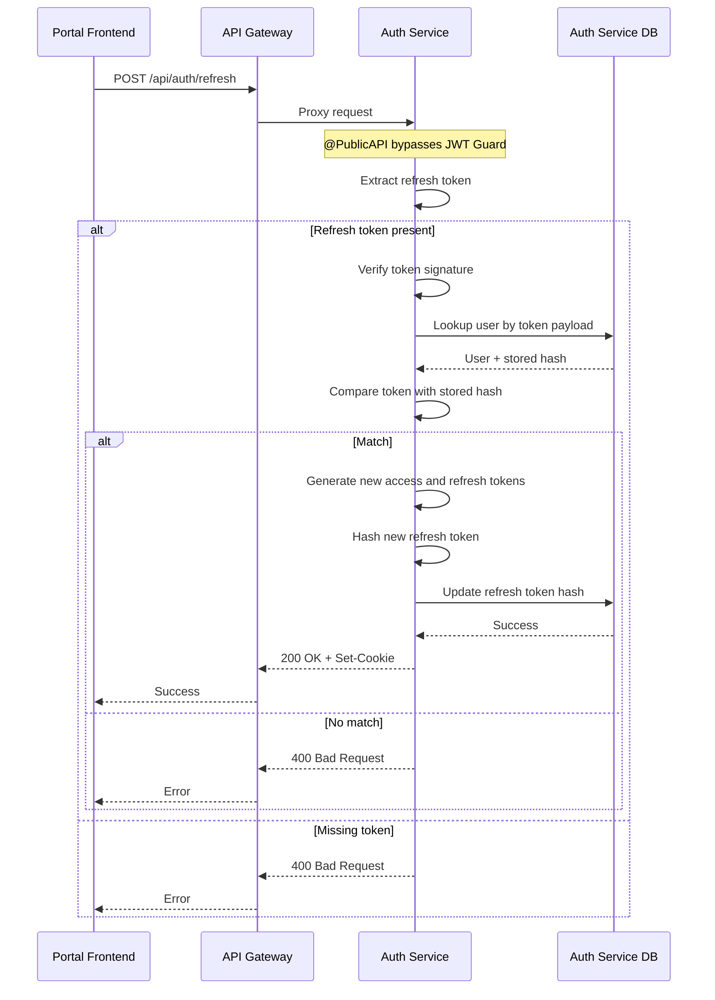

# Authentication and Authorization Architecture

## Overview

PawHaven uses a cookie-based JWT authentication system across multiple microservices. The flow is centered around:

- API Gateway routing requests to backend services
- Auth Service handling login, registration, refresh, and logout
- Shared JWT Guard and JWT Strategy enforced by default in each service
- Public endpoints explicitly marked with `@PublicAPI()`
- Each microservice owning its own database (auth data lives in the Auth Service DB)

## System Components

- Portal Frontend: collects credentials, sends requests, and keeps only user profile state
- API Gateway: central entry point that forwards cookies and headers to services
- Auth Service: validates credentials, issues tokens, rotates refresh tokens
- Domain Services: core/document/etc; verify tokens and use their own databases
- Shared Auth Infrastructure: JWT Guard, JWT Strategy, and PublicAPI decorator

## Authentication Flows

### 1. Login and Registration

**Details**

- Login and registration share the same token issuance and cookie response.
- Refresh tokens are stored as hashes in the Auth Service database.
- Tokens are delivered via HTTP-only cookies; frontend does not store raw tokens.

### 2. Token Verification (Protected Requests)

**Details**

- JWT Guard is registered globally in each service via the shared backend-core module.
- `@PublicAPI()` marks endpoints that bypass authentication.
- Each service validates tokens independently and can use its own database for authorization checks.

### 3. Token Refresh

**Details**

- Refresh rotates both access and refresh tokens.
- A refresh token is valid only if it matches the stored hash for that user.
- Refresh can be triggered explicitly (client call) or implicitly (AuthRefreshMiddleware).

**AuthRefreshMiddleware behavior**

- Attempts refresh when no access token, expired token, or token nearing expiry.
- On success: updates both response cookies and the request object for downstream handlers.
- On failure: clears cookies only when there is no valid access token; otherwise keeps the current token.

## Component Details

### API Gateway

- Acts as a single entry point for all client requests.
- Routes requests to the appropriate microservice and forwards cookies and headers.

### Auth Service

- Handles login, registration, refresh, and logout.
- Stores password hashes and refresh token hashes in its own database.
- Issues tokens and writes HTTP-only cookies in the response.

### JWT Guard and JWT Strategy (Shared)

- Provided by the shared backend-core package and imported by each microservice.
- JWT Guard enforces authentication by default.
- JWT Strategy validates the token and returns a normalized user payload.

### PublicAPI Decorator

- Marks endpoints as public to bypass the global JWT Guard.

### Auth Refresh Middleware

- Centralizes auto-refresh behavior for services that opt in.
- Keeps active sessions seamless by refreshing tokens before they expire.

## Logout

- Logout clears auth cookies and invalidates refresh token state in the Auth Service database.
- Clients should clear local user state and redirect to login.

## Security Considerations

- Use secure, HTTP-only cookies to prevent client-side access.
- Store refresh tokens as hashes and rotate on each refresh.
- Hash passwords using a strong one-way algorithm.
- Avoid leaking sensitive details in error responses and logs.
