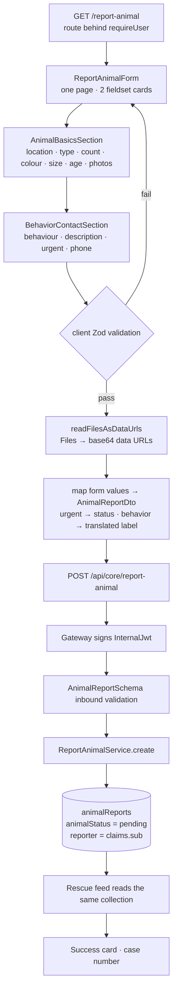

# Feature: Report a Stray Animal (`portal/src/features/report-animal`)

> **Status**: Implemented · **Verified against**: `core-service/modules/report-animal`, `portal/features/report-animal`
> **Feature docs**: [README](README.md) · **Sources**: [Product Blueprint §3](../product/PawHaven-Product-Strategy-EN.md) · [Design tokens](../../packages/design-system/src/tokens)

`/report-animal`, the only auth-gated route in the portal. One scrolling form that writes a single
row into `animalReports` with status `pending` — the same collection the rescue feed reads, so
**the report _is_ the case**.

## 1. Screens

One route, one page shell (`ReportAnimal.tsx`), and one of three mutually exclusive card states.
The page is **not** a wizard: it is a single `<form>` that scrolls, with two fieldset cards and a
submit button.

### 1.1 Basics card

Heading from `reportAnimal.basics_title`, body `components/AnimalBasicsSection.tsx`. Rendered
field order:

| Order | Control              | Field                              | Notes                                       |
| ----- | -------------------- | ---------------------------------- | ------------------------------------------- |
| 1     | `LocationSection`    | `address`, `latitude`, `longitude` | Coordinates omitted unless both are set     |
| 2     | `FormRadio`          | `animalType`                       | `cat` \| `dog` \| `other`                   |
| 3     | `FormInput`          | `otherAnimalType`                  | Rendered only when `animalType === 'other'` |
| 4     | `AnimalCountStepper` | `animalCount`                      | −/+ , min 1                                 |
| 5     | `FormInput`          | `coatColor`                        |                                             |
| 6     | `FormRadio`          | `size`                             | `small` \| `medium` \| `large`              |
| 7     | `FormRadio`          | `age`                              | `baby` \| `adult` — only two buckets        |
| 8     | `PhotoUpload`        | `photos`                           | See [§4](#4-photos)                         |

Location is rendered **first**, above the animal attributes, which is the reverse of the reading
order the DTO uses.

### 1.2 Behaviour card

Heading from `reportAnimal.behavior_title`, body `components/BehaviorContactSection.tsx`:

| Order | Control          | Field          | Notes                                                                                              |
| ----- | ---------------- | -------------- | -------------------------------------------------------------------------------------------------- |
| 1     | `FormRadio`      | `behavior`     | `friendly \| wary \| aggressive \| unknown` — see [§6](#6-two-contract-fields-the-service-drops)   |
| 2     | `FormInput`      | `description`  | ≤ 200 chars, trimmed on submit                                                                     |
| 3     | `FormCheckbox`   | `urgent`       | Collapses the DTO's `status` enum to 2 values — see [§6](#6-two-contract-fields-the-service-drops) |
| 4     | `FormPhoneInput` | `contactPhone` | `.trim()`ed on submit                                                                              |

Ticking `urgent` also reveals a static `bg-error-light` note reading
`reportAnimal.emergency_note`.

There is no email input. `contactInfo.email` is sent as a hard-coded `''`.

The submit button is a `Button type="submit"` with `loading={isPending}` and
`disabled={isPending}`, relabelled `reportAnimal.submitting` while in flight.

### 1.3 Success card

Once `submitted` is true the form is replaced by a confirmation card: a `CheckCircle` in
`bg-success-light`, `reportAnimal.success_title`, the case number, a `success_volunteers` line, and
a button back to `/`. The page also calls `window.scrollTo(0, 0)` on success.

The displayed case number is `data?.id` when the response carries one, otherwise a **fabricated**
`REP-${Date.now().toString().slice(-FALLBACK_ID_SUFFIX_LENGTH)}` — the last 8 digits of the
current epoch-millisecond timestamp. The fallback is not a server-issued identifier and does
not correspond to any record.

### 1.4 Stray CTA

`components/StrayCTA.tsx` renders below the form. It is a near-verbatim copy of
`home/components/StrayCTA.tsx`, differing only by a `full-width` class. Both link to
`/report-animal` (live) and `/volunteer` (**dead route**). See
[Home §1.4](02-home.md#14-stray-cta).

## 2. End-to-End Flow



`onSubmit` does the DTO mapping itself rather than submitting form values directly. The mapping is
where `animalType: 'other'` collapses to the free-text `otherAnimalType`, coordinates are omitted
unless both are present, and `status` is derived from the `urgent` checkbox.

## 3. Endpoint

| Method | Path                      | Policy        | Notes                                             |
| ------ | ------------------------- | ------------- | ------------------------------------------------- |
| POST   | `/api/core/report-animal` | authenticated | `AnimalReportSchema` inbound, `.parse()` outbound |

There is no list, read, update, or delete endpoint for reports. The feed reads them through the
rescue module's `GET /api/core/rescues` — see [Rescue Cases](04-rescue-cases.md).

## 4. Photos

Photos are **not uploaded to a file service**. `utils/readFilesAsDataUrls.ts` reads them in the
browser and `PhotoUpload` produces base64 data URLs that go straight into the JSON body, capped at
5 × 10MB. `reporterPhotosSchema` enforces the data-URL prefix
(`data:image/jpeg;base64,`, `…/jpg…`, `…/png…`) and the decoded byte size **on the server as
well** — the client and the API both validate.

Consequence: the stored document carries the image bytes, so `animalReports` documents are large.
The rescue feed works around this by serving one photo per request through
`GET /api/core/rescues/:id/photo/:index` and decoding on read.

## 5. Data Model

`animalReports` is shared with the rescue feature. The fields this feature writes:

| Field               | Type      | Source                                                                                                                                     |
| ------------------- | --------- | ------------------------------------------------------------------------------------------------------------------------------------------ |
| `animalType`        | String    | `cat` \| `dog` \| `other` (+ free-text when other)                                                                                         |
| `animalCount`       | Int       | Stepper, ≥ 1                                                                                                                               |
| `age`               | String    | `baby` \| `adult` — only two buckets                                                                                                       |
| `size`              | String    | `small` \| `medium` \| `large`                                                                                                             |
| `appearance`        | Json      | `{ color }` and nothing else                                                                                                               |
| `locationObj`       | Json      | `{ address, latitude?, longitude? }`                                                                                                       |
| `animalStatus`      | String    | Always `pending` on write                                                                                                                  |
| `statusDescription` | String?   | The **translated label** for the chosen `behavior`                                                                                         |
| `description`       | String    | ≤ 200 chars, trimmed                                                                                                                       |
| `reporterPhotos`    | String[]  | Base64 data URLs, 2–5 entries                                                                                                              |
| `reporter`          | Object?   | `{ reporterID: claims.sub, reporterName }`                                                                                                 |
| `status`            | String    | `@default("active")` — **written by nothing, read by nothing.** Not the DTO's `status`; see [§6](#6-two-contract-fields-the-service-drops) |
| `deletedAt`         | DateTime? | Soft delete; this is what `findAll` actually filters on                                                                                    |

`statusDescription` stores `t('reportAnimal.behavior_' + behavior)` — a **rendered translation**,
not the enum value. The row therefore records whichever locale was active in the reporter's
browser at submit time, and the same animal described by a `zh-CN` and an `en-US` reporter produces
two different stored strings. Nothing reads it as an enum.

## 6. Two contract fields the service drops

`ReportAnimalService.create` writes an **explicit field list** into Prisma:

```ts
data: {
  animalType, age, appearance, locationObj,
  animalStatus: AnimalStatus.PENDING, statusDescription, description,
  size, animalCount, reporter, reporterPhotos,
}
```

Two fields on `AnimalReportSchema` are absent from that list, and neither has a home on the model.
Both are validated in transit and then discarded.

### 6.1 `contactInfo`

`AnimalReportSchema` requires `contactInfo: { phone, email? }` and the client sends both. The
service does not persist it — the model has no contact field, and the string `contactInfo` appears
nowhere in `core-service` outside the shared schema. The phone number is collected, sent, validated
again, and thrown away; the email is not even collected, being hard-coded to `''` on the way out.
This is a real gap between the contract and the implementation, not a documentation error.

### 6.2 `status` — and a name collision

`status` on the DTO is `z.enum(['dangerous', 'friendly', 'scared', 'other'])` — a **temperament**
classification, four values. The form never lets a user choose it. `onSubmit` writes:

```ts
status: values.urgent ? 'dangerous' : 'other',
```

so a four-value enum is collapsed to two by a boolean that means something else, and `friendly` and
`scared` are unreachable. The form's actual behaviour control is a _different_ four-value radio,
`BEHAVIORS = friendly | wary | aggressive | unknown`. The two vocabularies overlap on exactly one
value, `friendly`; `wary`/`aggressive`/`unknown` have no counterpart in `status`, and
`dangerous`/`scared` have no counterpart in `behavior`. The user's actual behaviour answer is
discarded as a label into `statusDescription`, and an unrelated boolean is sent in its place.

The service then drops `status` too. The reason is almost certainly a **name collision**: the model
also has a column called `status`, defaulting to `"active"`, which is a soft-delete-style flag and
has nothing to do with temperament. Nothing writes that column — `create` omits it, so it takes the
default — and nothing reads it either, since `findAll` filters on `deletedAt: { isSet: false }`
rather than on `status`. It is a dead column whose name shadows a live contract field.

Net effect: **the only behaviour signal that survives is a translated string**, and the
`dangerous` value the form can send goes nowhere. `RescueListItemSchema` and `RescueDetailSchema`
expose neither, so the rescue feed cannot distinguish a dangerous animal from a friendly one.

## 7. Frontend Files

| File                                                                        | Role                                                     |
| --------------------------------------------------------------------------- | -------------------------------------------------------- |
| `route.tsx`                                                                 | `reportAnimalRoute`; the only `requireUser`-nested route |
| `ReportAnimal.tsx`                                                          | Page shell                                               |
| `components/ReportAnimalForm.tsx`                                           | RHF form; owns the DTO mapping and the success card      |
| `components/AnimalBasicsSection.tsx`                                        | §1.1                                                     |
| `components/LocationSection.tsx`                                            | Address + coordinates                                    |
| `components/PhotoUpload.tsx`                                                | File → data URL, count/size/type validation              |
| `components/AnimalCountStepper.tsx`                                         | Count −/+                                                |
| `components/BehaviorContactSection.tsx`                                     | §1.2                                                     |
| `components/StrayCTA.tsx`                                                   | §1.4 — duplicated from `home`                            |
| `constants.ts` / `components/types.ts`                                      | `ANIMAL_TYPES`, `SIZES`, `RescueAgeValues`               |
| `utils/readFilesAsDataUrls.ts`                                              | `File[]` → `string[]`                                    |
| `api/reportAnimal.api.ts` / `.mutations.ts` / `.queryKeys.ts`               | The call and its cache key                               |
| `tests/PhotoUpload.test.tsx` / `tests/ReportAnimalForm.validation.test.tsx` | The only two tests                                       |

Validation is schema-first on both sides, and the two schemas are deliberately different shapes:
`createReportAnimalFormSchema(messages)` builds a client Zod schema with translated messages,
while the server independently parses `AnimalReportSchema`. They are not shared, because `File`
cannot cross the wire and data URLs cannot exist in a form value.

## 8. What Does Not Exist

- **No wizard, no steps, no progress indicator.** One scrolling form.
- **No edit or delete.** A submitted report is immutable through the API, and there is no delete
  path at all.
- **No duplicate detection.** No radius/species dedupe, no `guestToken`.
- **No guest submission.** The route is behind `requireUser`, contradicting the blueprint.
- **No urgency tiers.** `low/medium/high/critical` does not exist. The one `urgent` boolean is
  folded into a temperament enum the user never sees and the service then discards — see
  [§6.2](#62-status--and-a-name-collision). Nothing downstream can tell an urgent report from a
  calm one.
- **No stored behaviour classification.** The user's `behavior` answer survives only as a
  translated string in `statusDescription`; the `status` enum designed to carry it is dropped.
- **No contact retention.** `contactInfo` is validated and dropped — see
  [§6.1](#61-contactinfo).
- **No locale-independent data.** `statusDescription` holds a rendered translation, so the stored
  value depends on the submitter's language.
- **No case creation step, no volunteer notification, no content recommendation.** The report is
  the case; there is no event bus and no other module reacts to it.
- **No geocoding.** `address` is typed; nothing resolves it to coordinates, and the feed renders
  neither.
- **No draft saving.** A reload loses the whole form, including already-decoded photo data URLs.

## 9. Related Docs

- [Rescue Cases](04-rescue-cases.md) — reads the same `animalReports` collection
- [Home](02-home.md) — surfaces the newest reports; owns the other `StrayCTA` copy
- [Auth](01-auth.md) — `requireUser`, the only guard on this route
- [Product Blueprint §3 (Discovery)](../product/PawHaven-Product-Strategy-EN.md) — the intended
  version of this flow, including guest submission and duplicate detection
