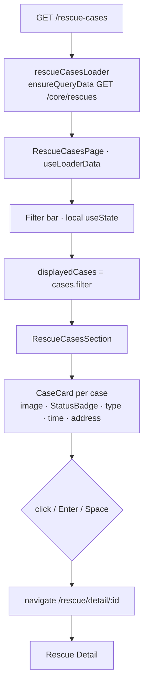

# Feature: Rescue Cases (`portal/src/features/rescue-cases`)

> **Status**: Implemented · **Verified against**: `core-service/modules/rescue`, `portal/features/rescue-cases`
> **Feature docs**: [README](README.md) · **Sources**: [Product Blueprint §4–8](../product/PawHaven-Product-Strategy-EN.md) · [Design tokens](../../packages/design-system/src/tokens)

`/rescue-cases`, the public browse feed. Rows are reports — there is no separate case table, so
this feature and [Report a Stray Animal](03-report-animal.md) are two views of one collection.

## 1. Sections

`RescueCases.tsx` renders a filter bar and a list, inside `max-w-6xl px-4`.

### 1.1 Filter bar

A horizontally scrollable row of pill buttons (`flex gap-1 overflow-x-auto pt-10`) driven by a
local `useState<FilterStatus>`. Three options, from `FILTER_OPTIONS`:

| Value                     | Label key                         |
| ------------------------- | --------------------------------- |
| `all`                     | `rescue_cases.filter_all`         |
| `AnimalStatus.pending`    | `common.rescue_status_pending`    |
| `AnimalStatus.inProgress` | `common.rescue_status_inProgress` |

`inProgress` is rendered with a **camelCase i18n key** (`rescue_status_inProgress`), which
contradicts the project's snake_case key rule.

Filtering is **client-side only** — `displayedCases` is a `cases.filter(...)` over the array the
loader already fetched. Switching filters costs no request. Because the server call passes no
status, the fetched set is whatever `latestRescueLimit` allows, so a filter can only ever narrow
that window; it cannot reach a case the initial query did not return.

Only two of the seven statuses are filterable. `treated`, `recovering`, `awaitingAdoption`,
`adopted`, and `failed` have no filter and are unreachable through this UI — see
[§5](#5-status).

### 1.2 Case list

`components/RescueCasesSection.tsx` receives `cases={displayedCases}` and `onCaseClick`, and
deliberately omits `onSeeAll` and `showStatusSummary` (defaults: absent / `true`). So the
"see all" affordance is omitted — correct, since this _is_ the full list — but the pending /
in-progress counter **is** rendered here, unlike on the homepage.

States:

| State       | Rendering                                      |
| ----------- | ---------------------------------------------- |
| `isLoading` | `RescueCasesSectionSkeleton`                   |
| empty       | `rescue_cases.no_cases_found`, `py-16` centred |
| populated   | `CaseCard` per case                            |

`safeCases = cases ?? []` guards the null case even though the loader's type says otherwise.

`CaseCard` is a `div` with `role="button"`, `tabIndex={0}` and an `onKeyDown` that activates on
`Enter` or `Space` — so the card is keyboard-reachable, but the `role="button"` element has no
`aria-label` beyond the visible title.

Each card shows a 48-unit-tall image or a `PhotoPlaceholder` fallback, a `StatusBadge`, the
animal type, `formatDateTime`, and a `MapPin` with the address. `distance` is not rendered.

## 2. End-to-End Flow



## 3. Endpoints

| Method | Path                                 | Policy            | Notes                                         |
| ------ | ------------------------------------ | ----------------- | --------------------------------------------- |
| GET    | `/api/core/rescues`                  | `@OptionalAuth()` | `?status=` `?limit=`                          |
| GET    | `/api/core/rescues/:id`              | `@OptionalAuth()` | 400 if missing or soft-deleted                |
| GET    | `/api/core/rescues/:id/photo/:index` | `@OptionalAuth()` | Decodes one data URL to a binary stream       |
| POST   | `/api/core/rescues`                  | authenticated     | Writes the same collection as `report-animal` |

The two write paths are near-duplicates. `RescueService.create` and `ReportAnimalService.create`
both insert into `animalReports` with `reporter` taken from the internal JWT; only the
`animalStatus` seeding and the DTO differ. **In practice the portal uses `report-animal`** — nothing
in the portal calls `POST /core/rescues`.

## 4. Listing Behaviour

`findAll(status?, limit?)`:

- filters `deletedAt: { isSet: false }` and, when given, `animalStatus`
- orders by `createdAt` desc
- applies `take` only — **`limit` is not pagination.** There is no cursor, no page parameter, and
  no total count, so a caller cannot walk past the first `limit` records.
- projects a fixed 7-field `select`, then a **second query** fetches which of those rows have photos
- `RescueListItemSchema.parse` runs per row; a row that fails to map is **skipped with a warning**
  rather than failing the request, so one bad document silently shortens the feed

`distance` is hard-coded to `0` in `toListItem`. Location is a `{ address, latitude?, longitude? }`
object and nothing computes distance from it.

## 5. Status

`AnimalStatus` in `packages/shared/types/AnimalStatus.ts` defines seven values:

```
pending → inProgress → treated → recovering → awaitingAdoption → adopted
                                                             ↘ failed
```

Two naming conventions coexist deliberately: `animalStatus` is the DB field, `status` is the
API/display field. The read projections map between them and fall back to `pending` when the
stored value fails `AnimalStatusSchema.safeParse`.

**Only `pending` is ever written.** There is no transition endpoint, no transition table, and no
code that moves a case to any other value. The six other states are a declared vocabulary awaiting
an implementation. `inProgress` is filterable but unreachable; the remaining five cannot be produced
at all. The `home` module _counts_ `animalStatus: adopted` rows, but no code path produces them, so
half of the homepage's "adopted" figure is structurally zero.

## 6. The Status Ladder

`components/RescueTimeline.tsx` (this feature's copy) takes `currentStatus: AnimalStatus` and
renders the seven-stage ladder, marking earlier stages complete and the current one active.

It is a **projection of a single field**, not a history: given `pending` it shows stage 1 lit and
stages 2–7 greyed. Since only `pending` is ever written, the ladder never advances past its first
stage in practice. `RescueDetailSchema` has no timeline field and no collection stores transitions.

`CaseDetail.tsx` renders this ladder, plus a `StatusBadge` and a single image — but **`CaseDetail`
is exported and used by nothing.** It is a dead component, superseded by the detail page.

## 7. Photos

`reporterPhotos` holds base64 data URLs inside the document. `findPhoto(id, index)` looks the row
up, `decodePhoto` splits the mime type from the payload, and the controller returns the buffer
with `Content-Type` from the stored mime type and
`Cache-Control: public, max-age=31536000, immutable`.

The service hard-codes the public route `/api/core/rescues` to build `image` URLs on list items, so
the browser fetches **each image with a second request** instead of receiving them inline. A feed
of 10 cases with 5 photos each is 11 requests, not 1.

## 8. Frontend Files

| File                                                                   | Role                                              |
| ---------------------------------------------------------------------- | ------------------------------------------------- |
| `route.tsx`                                                            | `rescueCasesRoute` + `rescueCasesLoader`; `lazy:` |
| `RescueCases.tsx`                                                      | §1 — filter bar + list, page shell                |
| `types.ts`                                                             | `RescueCase`, `FilterStatus`                      |
| `components/RescueCasesSection.tsx`                                    | §1.2 — also imported by `home`                    |
| `components/RescueCasesSectionSkeleton.tsx`                            | Loading state                                     |
| `components/CaseCard.tsx`                                              | One card                                          |
| `components/StatusBadge.tsx`                                           | Status pill                                       |
| `components/RescueTimeline.tsx`                                        | §6 — the ladder                                   |
| `components/CaseDetail.tsx`                                            | **Dead — no caller**                              |
| `api/rescueCases.api.ts` / `.queries.ts` / `.queryKeys.ts`             | The call and its cache key                        |
| `tests/RescueCasesPage.test.tsx` / `tests/RescueCasesSection.test.tsx` | The only two tests                                |

`rescueCasesLoader` uses `ensureQueryData` and takes no argument, so the feed is a single
uncached-by-parameter snapshot: visiting the page after another user reports a new animal serves
whatever `staleTime` allows, with no refetch trigger tied to the route.

## 9. What Does Not Exist

- **No case creation as a separate step.** A report is already a case.
- **No claiming, no assignee, no `rescue_transitions`, no transition history.** The 7-stage
  machine is an enum, not a state machine.
- **No status update endpoint.** `PATCH /rescues/:id/status` is not implemented; the only mutating
  route is `POST /rescues`, which the portal never calls.
- **No follow/claim coupling.** Following is a separate feature, embedded in the detail page — see
  [Rescue Detail §1.4](05-rescue-detail.md#14-follow).
- **No map, no geo query, no radius filter, no species filter, no search.** Only `status` and
  `limit`.
- **No server-side filtering or sorting.** The filter bar is a client-side `.filter()` over an
  already-truncated array.
- **No infinite scroll, no pagination controls, no result count.**
- **No domain events.** Nothing is published on create; no module is notified.
- **No SLA or escalation.**
- **No share control** — the detail page's share button has no `onClick`.

## 10. Related Docs

- [Report a Stray Animal](03-report-animal.md) — the write path, on the same collection
- [Rescue Detail](05-rescue-detail.md) — where a card navigates to
- [Home](02-home.md) — embeds `RescueCasesSection`; the cross-feature import
- [Product Blueprint §4–8](../product/PawHaven-Product-Strategy-EN.md) — the intended lifecycle,
  which is where timelines, claims, and the transitions table come from
