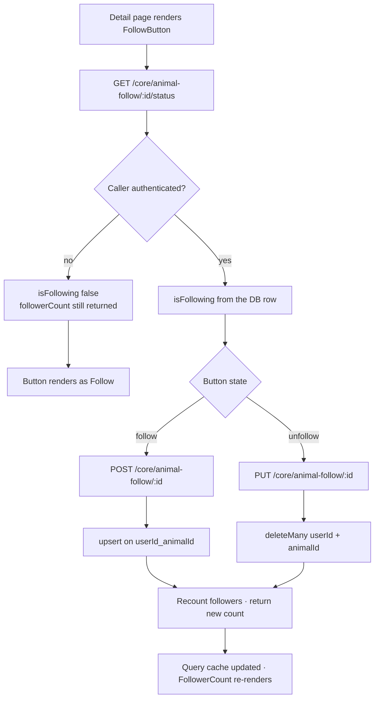
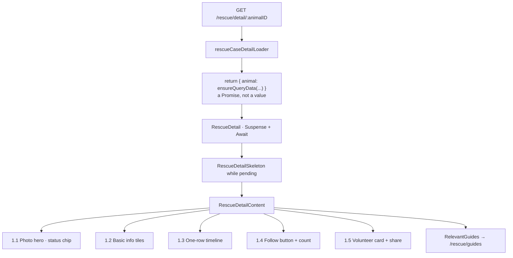

# Feature: Rescue Detail (`portal/src/features/rescue-detail`)

> **Status**: Implemented · **Verified against**: `core-service/modules/rescue`, `core-service/modules/animal-follow`, `portal/features/rescue-detail`, `portal/features/animal-follow`
> **Feature docs**: [README](README.md) · **Sources**: [Product Blueprint §3, §4–8](../product/PawHaven-Product-Strategy-EN.md) · [Design tokens](../../packages/design-system/src/tokens)

`/rescue/detail/:animalID`, the single-animal page. It is the most composite page in the portal: it
renders six distinct regions, and it is the **only** place the `animal-follow` feature's UI appears.

## 1. Sections

`RescueDetailContent.tsx` composes the page inside `mx-auto max-w-3xl py-6`, with a two-column
grid below the header (`lg:grid-cols-3`; the left column spans 2).

A back button (`navigate(-1)`, `rescue_cases.back_to_cases`) sits above everything.

### 1.1 Photo hero

Conditional on `animal.photos.length > 0` — a report with no photos gets no header block at all,
not even a placeholder.

A `Carousel` from `@pawhaven/ui` with `autoplay` and `loop`, `h-48 sm:h-60`, plus two absolutely
positioned overlays:

- **Status chip** (top-left): a coloured dot from `getStatusColorByPrefix({ status, prefix: 'bg' })`
  with a `bg-slate-400` fallback, beside `t('common.rescue_status_' + status)`.
- **Type and address** (bottom, over a `from-black/70` gradient): the animal type via
  `t('reportAnimal.' + animalType, { defaultValue: animalType })`, and the address with a `MapPin`,
  rendered only when `location.address` is present.

Because the whole block is gated on `photos.length`, **a report with no photos shows no status at
all** — the one piece of state a rescuer most needs is invisible.

### 1.2 Basic info

A card holding the free-text `description` (only when non-empty) and `AnimalBasicInfo`, which
renders a grid of `InfoTile`s. `InfoTile` is a local presentational atom — an icon, a label, and a
value — and it exists only here.

### 1.3 Timeline

`RescueTimeline` (this feature's copy) takes an `updates[]` prop, unlike the ladder component in
[Rescue Cases §6](04-rescue-cases.md#6-the-status-ladder). Its only caller builds that array
inline with **exactly one synthetic entry**, derived from the report itself:

```ts
const timelineUpdates = [
  {
    status: t('rescueDetail.timeline_reported'),
    time: formatDateTime(animal.reportedAt, i18n.language),
    description: animal.description ?? animal.statusDescription ?? '',
    author: animal.reporter.reporterName ?? t('common.anonymous'),
  },
];
```

So the "timeline" is a single-row restatement of the report. `RescueDetailSchema` has no timeline
field, and no collection stores transitions. The status chip, the ladder, and this one-row timeline
are three independent renderings of "this report exists".

### 1.4 Follow

This is the `animal-follow` feature's entire user-facing surface. It is **not** a component of
`rescue-detail`; `rescue-detail` imports across feature boundaries:

```ts
import { FollowButton } from '@/features/animal-follow/components/FollowButton';
import { FollowerCount } from '@/features/animal-follow/components/FollowerCount';
```

Both sit in the second card of `VolunteerInfo`. `FollowButton` toggles optimistically; `FollowerCount`
shows the number. Neither fetches on its own behalf beyond the shared query.

The backend is `core-service/modules/animal-follow`:

| Method | Path                                       | Policy            | Notes                                |
| ------ | ------------------------------------------ | ----------------- | ------------------------------------ |
| GET    | `/api/core/animal-follow/:animalId/status` | `@OptionalAuth()` | `isFollowing` is false for anonymous |
| POST   | `/api/core/animal-follow/:animalId`        | authenticated     | Idempotent upsert                    |
| PUT    | `/api/core/animal-follow/:animalId`        | authenticated     | Idempotent delete                    |



`animalId` is an opaque string. **Nothing verifies that it names an existing animal** — there is no
foreign key to `animalReports` and no existence check in the service. Following an arbitrary string
succeeds and simply never appears on any page.

`PUT` for unfollow is unusual but deliberate: `deleteMany` makes the write idempotent, so
unfollowing something you do not follow succeeds instead of 404-ing. `POST` is an `upsert` with an
empty `update`, and it catches Prisma `P2002` and re-reads the existing row on that specific code —
a deliberate race-path recovery, so two concurrent follows of the same animal do not surface one as
a 400.

`AnimalFollow` is the only model in the project with a compound unique constraint, and the reason
`POST` can be an upsert:

| Field                     | Type     | Notes                                |
| ------------------------- | -------- | ------------------------------------ |
| `id`                      | ObjectId | `@map("_id")`                        |
| `userId`                  | String   | From the internal JWT `sub`          |
| `animalId`                | String   | Free-form — no referential integrity |
| `createdAt` / `updatedAt` | DateTime |                                      |

```prisma
@@unique([userId, animalId])
@@index([animalId])
@@map("animal_follows")
```

The `animalId` index exists to make `followerCount`'s `count({ where: { animalId } })` cheap. The
`followedAt` the service returns is the upsert's `createdAt`; because a real unfollow deletes the
row, re-following mints a new timestamp.

### 1.5 Volunteer card

`VolunteerInfo` is a three-card stack, and its `volunteer` prop is optional:

| Card | Rendering                                                                           |
| ---- | ----------------------------------------------------------------------------------- |
| 1    | Volunteer identity **or** `rescueDetail.no_volunteer` when `volunteer` is undefined |
| 2    | `FollowButton` + `FollowerCount` — §1.4                                             |
| 3    | A share button                                                                      |

`RescueDetailContent` renders it as `volunteer={undefined}` — **the only call site, and it always
passes `undefined`.** So card 1 always takes the `else` branch, and the entire `volunteer ?` half —
avatar, name, completed-rescue count, the "currently handling" banner, and the "offer assistance"
button — is **unreachable code**. There is no volunteer assignment in the data model to feed it;
see [Auth §7](01-auth.md#7-what-does-not-exist).

Card 3's share button has **no `onClick`**. It is a dead control.

### 1.6 Relevant guides

`components/RelevantGuides.tsx` renders a card of guide links. It is a **hard-coded link list**,
not a query: it does not call the guide API and has no data prop, so which guides appear is fixed
at build time and cannot respond to the animal's species, category, or situation. Links go to
[Rescue Guide](06-rescue-guide.md).

It is the only outbound link from a detail view.

## 2. End-to-End Flow



The loader returns `{ animal: Promise<RescueDetail> }` rather than the value, and the component
defers to `<Suspense>` + `<Await>`. This is the only page in the portal that does so — every other
loader resolves to data. The fallback is `RescueDetailSkeleton`.

## 3. Endpoint

| Method | Path                    | Policy            | Notes                          |
| ------ | ----------------------- | ----------------- | ------------------------------ |
| GET    | `/api/core/rescues/:id` | `@OptionalAuth()` | 400 if missing or soft-deleted |

`toDetail` maps `animalStatus` → `status` with the same `safeParse`-or-`pending` fallback as the
list, and resolves `photos` to an array of `/api/core/rescues/:id/photo/:index` URLs.

`distance` is hard-coded to `0` here too, and is not rendered.

## 4. Data Model

No detail-owned collection. `RescueDetail` is a read model over `animalReports`; `AnimalFollow` is
the only collection this page writes. See [Rescue Cases](04-rescue-cases.md) for the field list and
[Report a Stray Animal §6](03-report-animal.md#6-two-contract-fields-the-service-drops) for the two
contract fields the write path discards.

## 5. Frontend Files

| File                                                                  | Role                                  |
| --------------------------------------------------------------------- | ------------------------------------- |
| `route.tsx`                                                           | `rescueDetailRoute` + loader; `lazy:` |
| `RescueDetail.tsx`                                                    | `Suspense`/`Await` shell              |
| `components/RescueDetailContent.tsx`                                  | §1 — composes all six regions         |
| `components/RescueDetailSkeleton.tsx`                                 | Suspense fallback                     |
| `components/AnimalBasicInfo.tsx`                                      | §1.2                                  |
| `components/InfoTile.tsx`                                             | §1.2 — local atom, used here only     |
| `components/RescueTimeline.tsx`                                       | §1.3 — the single-row variant         |
| `components/VolunteerInfo.tsx`                                        | §1.4, §1.5                            |
| `components/RelevantGuides.tsx`                                       | §1.6 — a hard-coded link list         |
| `api/rescueDetail.api.ts` / `.queries.ts` / `.queryKeys.ts`           | The call and its cache key            |
| `tests/RescueDetailContent.test.tsx` / `tests/VolunteerInfo.test.tsx` | The only two tests                    |

`rescueDetail` is the only feature with a **separate query key per animal id**, so two animals can
be cached side by side — the correct pattern, and the one [Rescue Cases](04-rescue-cases.md) does
not follow.

### 5.1 The `animal-follow` feature directory

`portal/src/features/animal-follow` is a top-level feature folder (10 files) that **no route
mounts**. It is consumed only by `rescue-detail`:

| File                                                                               | Role                            |
| ---------------------------------------------------------------------------------- | ------------------------------- |
| `components/FollowButton.tsx`                                                      | Toggle, optimistic              |
| `components/FollowerCount.tsx`                                                     | The count                       |
| `api/animalFollow.api.ts`                                                          | The three calls                 |
| `api/animalFollow.queries.ts` / `.queryKeys.ts`                                    | Query + key factory             |
| `api/tests/animalFollow.api.test.ts` / `api/tests/animalFollow.mutations.test.tsx` | Two of the feature's four tests |
| `tests/FollowButton.test.tsx` / `tests/FollowerCount.test.tsx`                     | The other two                   |

It is the one place two features share UI without it being promoted to `packages/ui`, even though
the shared surface is a stable, self-contained button-plus-count pair. See
[Component Rules](../../.opencode/skills/project-rules/references/components.md).

## 6. What Does Not Exist

- **No status change, no claim, no assignee, no transition history.** The timeline is one synthetic
  row built from the report itself; see [§1.3](#13-timeline).
- **No volunteer assignment.** `volunteer={undefined}` is hard-coded, so the entire populated
  branch of `VolunteerInfo` — avatar, name, rescue count, "offer assistance" — never renders.
- **No sharing.** The share button has no handler; there is no share endpoint and no Web Share API
  call.
- **No contact with the reporter.** `reporter.reporterID` and `reporterName` are stored, but
  `contactInfo` was never persisted, so there is no phone or email to show even in principle.
- **No status chip when there are no photos** — the whole hero block is gated on
  `photos.length > 0`.
- **No map, no distance, no directions link.**
- **No follow on the list view** — only here.
- **No follower list.** The count is a number; no endpoint returns _who_ follows.
- **No notification on follow**, and no notification of any kind.
- **No follow for guests, no follow-by-email, no way to follow without an account.**
- **No cascade cleanup.** `animalId` has no foreign key, so deleting a report would orphan its
  follow rows. There is no delete path for reports today, so this is latent.
- **No relevance logic on the guides card** — it is a fixed link list; see [§1.6](#16-relevant-guides).
- **No 404 page for a missing animal.** A bad id returns 400 from the endpoint and surfaces as a
  thrown loader error into the shell's `ErrorBoundary`.

## 7. Related Docs

- [Rescue Cases](04-rescue-cases.md) — the feed this page is reached from, and the list endpoint
- [Rescue Guide](06-rescue-guide.md) — where §1.2's links go
- [Auth](01-auth.md) — the identity `AnimalFollow.userId` is keyed by; the absent volunteer network
- [Report a Stray Animal](03-report-animal.md) — the write path, and the dropped contact fields
