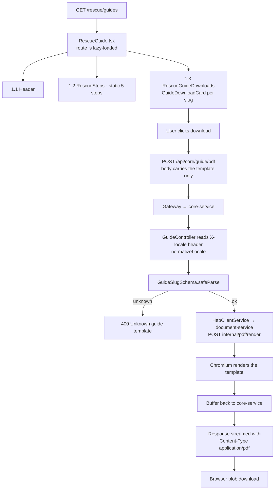

# Feature: Rescue Guide (`portal/src/features/rescue-guide`)

> **Status**: Implemented · **Verified against**: `core-service/modules/guide`, `document-service/modules/pdf`, `portal/features/rescue-guide`
> **Feature docs**: [README](README.md) · **Sources**: [PDF Generation](../architecture/PawHaven-PDF-Generation.md) · [Design tokens](../../packages/design-system/src/tokens)

`/rescue/guides`, four printable rescue guides rendered to PDF on demand. The catalogue is four
string literals in a shared schema — no CMS, no article collection, no search.

## 1. Sections

`RescueGuide.tsx` renders a header and two sections inside `mx-auto max-w-5xl px-4 py-8`.

### 1.1 Page header

A `bg-hero-bg` rounded panel with an uppercase eyebrow (`rescueGuide.eyebrow`), the `h1`
(`rescueGuide.title`), and an intro paragraph (`rescueGuide.intro`). No data, no query.

### 1.2 Rescue steps

`components/RescueSteps.tsx` under `rescueGuide.steps_title`. A static 5-step visual — the icons
come from `rescueStepIcons` in `constants.ts` (`Search`, `ShieldCheck`, `Droplets`, `PhoneCall`,
`Camera`) and the labels from translation keys. It fetches nothing and takes no props, so the
sequence is fixed at build time and identical in all three locales.

### 1.3 Guide downloads

`components/RescueGuideDownloads.tsx` under `rescueGuide.documents_title`, rendering one
`GuideDownloadCard` per entry in `rescueGuideCatalog`. Each card pairs a `slug` with a
`fileName` and an icon, and its click posts to the PDF endpoint.

Two catalogues exist and must stay in step:

| Source                                                  | Holds                      | Consumers                           |
| ------------------------------------------------------- | -------------------------- | ----------------------------------- |
| `guideSlugs` in `packages/shared/types/Guide.schema.ts` | The 4 slugs — the contract | Server validation, `GuideSlug` type |
| `rescueGuideCatalog` in `rescue-guide/constants.ts`     | slug + `fileName` + icon   | The cards on this page              |

| Slug             | `fileName`                       | Icon          | Category  |
| ---------------- | -------------------------------- | ------------- | --------- |
| `rescueGuide`    | `PawHaven-Rescue-Basics`         | `BookOpen`    | `rescue`  |
| `firstAid`       | `PawHaven-First-Aid-Reference`   | `HeartPulse`  | `medical` |
| `kittenCare`     | `PawHaven-Orphaned-Baby-Care`    | `Baby`        | `care`    |
| `injuryResponse` | `PawHaven-Injury-Field-Response` | `ShieldAlert` | `medical` |

The `category` column is **not** in `rescueGuideCatalog` — the page never displays or filters by
it. `guideCategories` exists in the shared schema and is used by `guideCatalogItemSchema`, which
nothing reads; see [§5](#5-what-the-shared-schema-defines-and-nothing-uses).

## 2. End-to-End Flow

The request body carries **only the template**. Locale travels in the `X-locale` **header**, not
the body: `apiClient` attaches it, the controller reads it with `firstLocale()` (the first entry of
a comma-separated list), and `GuideService` forwards it explicitly to document-service — because
`PdfService` resolves the rendering locale from that header. Sending it in the body as well would
be ignored.

`normalizeLocale` falls back to `en-US` for anything unrecognised, so an unknown `X-locale` never
errors; it silently renders English.

## 3. Endpoints

### The portal's route

| Method | Path                  | Policy        | Notes                                      |
| ------ | --------------------- | ------------- | ------------------------------------------ |
| POST   | `/api/core/guide/pdf` | authenticated | Body: template only. Returns a PDF stream. |

`GuideService`'s own comment gives three reasons the route goes through `core-service` rather than
the portal calling document-service directly, and all three are load-bearing:

1. The browser keeps a single upstream, so there is one place auth and locale are negotiated.
2. `GuideSlugSchema` is enforced at this hop. `RenderPdfBodySchema` in document-service would
   reject the **entire** call over one bad slug; validating here fails that one request.
3. The request gets a real multi-hop trace: `gateway → core-service → document-service`.

The controller uses `@Res()` deliberately, with `@HttpCode(200)`. Returning the buffer normally
would let the global `HttpSuccessInterceptor` wrap it in the JSON success envelope and corrupt the
download; a bare `@Post` would answer `201`, which breaks the client's blob handling.

### document-service's surface

| Method | Path                   | Notes                                             |
| ------ | ---------------------- | ------------------------------------------------- |
| POST   | `/internal/pdf/render` | Internal. Called by core-service, not the browser |
| POST   | `/pdf/download`        | Direct browser download                           |
| POST   | `/pdf/preview`         | Inline preview                                    |
| POST   | `/email/send`          | Transactional mail                                |
| POST   | `/email/preview`       | Render-only mail                                  |

Only `/internal/pdf/render` is reachable from this feature. The other four have no caller in the
portal. `document-service` launches headless Chromium at runtime, so the binary must be present in
the environment — see [PDF Generation](../architecture/PawHaven-PDF-Generation.md).

## 4. Data Model

No collection. The guides are Chromium templates compiled into `document-service`; the catalogue
is literals in two places (§1.3).

## 5. What the shared schema defines and nothing uses

`packages/shared/types/Guide.schema.ts` is considerably richer than the page needs. Defined and
unread:

| Export                   | What it would carry                                             | Status                                |
| ------------------------ | --------------------------------------------------------------- | ------------------------------------- |
| `guideCategories`        | `rescue \| medical \| care`                                     | Used only by `guideCatalogItemSchema` |
| `guideSurfaces`          | `['pdf']` — a single-member array                               | Used only by `guideCatalogItemSchema` |
| `guideCatalogSchema`     | Full catalogue: title, description, category, locales, surfaces | **Read by nothing**                   |
| `guideCatalogItemSchema` | One catalogue entry                                             | Read only by the array above          |
| `guideProvenanceSchema`  | `source` / `url` / `reviewedAt`                                 | **Read by nothing**                   |
| `GuideDocumentsSchema`   | slug + fileName + locales                                       | **Read by nothing**                   |
| `GuideSurfaceSchema`     | The `pdf` surface enum                                          | Read only by `guideCatalogItemSchema` |

`guideCatalogSchema` is the interesting one: it is precisely the shape the page hand-rolls in
`rescueGuideCatalog`, and adopting it would remove the two-catalogue sync problem in §1.3. It also
carries `description` and `locales`, which would make the catalogue translatable — today the guide
titles are translation keys, so the catalogue's own metadata has nowhere to live.

`guideProvenanceSchema` is a source-attribution record — `source`, `url`, `reviewedAt` — for
medical and rescue content. Nothing writes it, so the project has no record of where its
first-aid and injury-response guidance came from.

## 6. Frontend Files

| File                                  | Role                                                                                          |
| ------------------------------------- | --------------------------------------------------------------------------------------------- |
| `route.tsx`                           | `rescueGuideRoute`; `lazy:`                                                                   |
| `RescueGuide.tsx`                     | §1 — page shell                                                                               |
| `components/RescueGuideDownloads.tsx` | §1.3                                                                                          |
| `components/GuideDownloadCard.tsx`    | One card                                                                                      |
| `components/RescueSteps.tsx`          | §1.2                                                                                          |
| `constants.ts`                        | `rescueGuideCatalog`, `rescueStepIcons`, `rescueGuidePresentations`, `rescueGuideDefaultIcon` |
| `types.ts`                            | Section-local types                                                                           |
| `api/pdf.api.ts`                      | The POST and its blob handling                                                                |
| `api/pdf.api.test.ts`                 | The feature's only test                                                                       |

`rescueGuideRoute` is `lazy:` — a dynamic `import()` of its Component. It is one of **four** routes
that do this (`report-animal`, `rescue-cases`, `rescue-detail`, `rescue-guide`); `home` and the two
auth routes pass `Component` directly.

`rescueGuidePresentations` (icons by slug) and `rescueGuideCatalog` (slug + fileName) are two
separate maps keyed by the same slugs, and `rescueGuideDefaultIcon` exists to cover a slug absent
from the first — belt and braces for data that is already validated by `GuideSlugSchema`.

## 7. What Does Not Exist

- **No CMS, no articles, no search, no category browsing.** The catalogue is four literals and the
  page is four cards. `guideCategories` is defined and never displayed.
- **No `GET /api/core/guide`** listing endpoint. The catalogue reaches the client because it is
  compiled into the page, not fetched.
- **No per-guide content in the database.** The PDFs are Chromium templates in document-service.
- **No provenance record** — see [§5](#5-what-the-shared-schema-defines-and-nothing-uses).
- **No on-page reader.** Every guide is a download; there is no inline preview despite
  `POST /pdf/preview` existing.
- **No email delivery of a guide**, despite document-service having a working email module with two
  endpoints.
- **No print-optimised page.** The guides are PDFs, not a styled print stylesheet.
- **No guide detail route, no deep link to a single guide.** The download is a direct POST from the
  card, so a guide cannot be linked, bookmarked, or shared.
- **No download progress or error state** beyond the browser's own handling of the blob.

## 8. Related Docs

- [PDF Generation](../architecture/PawHaven-PDF-Generation.md) — the renderer and its templates
- [Rescue Detail](05-rescue-detail.md) — `RelevantGuides` links here
- [Design tokens](../../packages/design-system/src/tokens) — the `bg-hero-bg` panel and icon sizing
