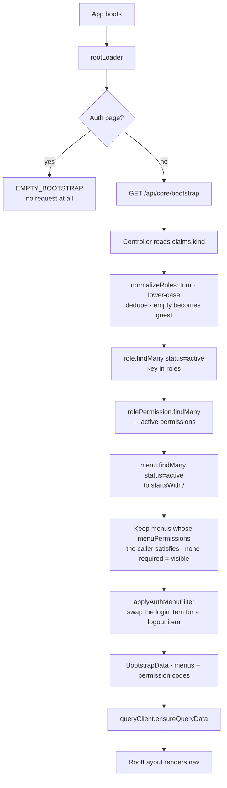

# Feature: App Shell & Bootstrap (`portal/src/layout`)

> **Status**: Implemented, partial · **Verified against**: `core-service/modules/bootstrap`, `portal/src/layout`, `portal/src/router`
> **Feature docs**: [README](README.md) · **Sources**: [Frontend Architecture](../architecture/PawHaven-Frontend-Architecture.md) · [Backend Architecture](../architecture/PawHaven-Backend-Architecture.md) · [Route Authentication](../architecture/route_authentication.md)

**This is not a portal feature folder.** It is `layout/` — the app shell every page renders inside,
plus the one backend module that feeds it. It is documented here because it is real, working code
with its own collection and endpoint, not because it is a page.

**Menus are config-driven; routes are not.** The frontend route tree is a static literal in
`router/router.tsx`. The blueprint's claim that "new features ship by adding config entries without
redeploying the frontend routing tree" is not true of this codebase.

## 1. Sections

`RootLayout.tsx` composes the shell around an `<Outlet />`.

### 1.1 Navigation

`RootLayoutMenu` / `RootLayoutSidebar`, rendered inside a sticky `header`
(`z-sticky bg-background/88 backdrop-blur-md`) — **but only when `!isAuthPage`**, and within that
only when `isMenuAvailable`. The auth routes set `handle: { isMenuAvailable: false,
isFooterAvailable: false }` and are excluded by path anyway, so both mechanisms suppress it.

Menu items come from `useLoaderData()` as `bootstrapData?.menus ?? []` — never from a constant.

`useMenuVisibility` reads the current route's `handle` for the two flags, defaulting both to
`true`, and computes `isAuthPage` from a path list rather than from `handle`. So there are two
independent mechanisms for the same decision, and they happen to agree.

`useMenuNavigation` handles active-state highlighting against the current `pathname`.

### 1.2 Maintenance banner

When `isSysMaintain` is true in the Redux global slice, a `NotificationBanner`
(`type: 'info'`, `variant: 'filled'`, `dismissible: false`) is pushed above the menu with the
`common.mockDataWarning` message. This is the only place in the portal that acknowledges the
project's data is placeholder.

### 1.3 Outlet, error boundary, and footer

```tsx
<ErrorBoundary FallbackComponent={ContentFallback} key={pathname}>
  <Suspense fallback={<Loading />}>
    <Outlet />
  </Suspense>
</ErrorBoundary>
```

The `key={pathname}` remounts the boundary on every navigation, so a thrown loader error clears on
route change instead of sticking. `<ScrollRestoration />` and `<Toast />` sit at the shell level.

`RootLayoutFooter` renders when `isFooterAvailable`.

**The footer links to 11 paths; 3 of the 7 real routes are among them, and 8 are dead:**

| Link target          | Label key                                    | Status                                   |
| -------------------- | -------------------------------------------- | ---------------------------------------- |
| `/rescues`           | `footer.columns.platform.browse_rescues`     | **Dead** — real route is `/rescue-cases` |
| `/report-animal`     | `footer.columns.platform.report_animal`      | Live                                     |
| `/adopt`             | `footer.columns.platform.adopt_animal`       | **Dead**                                 |
| `/volunteer`         | `footer.columns.platform.volunteer`          | **Dead**                                 |
| `/knowledge`         | `footer.columns.resources.knowledge_base`    | **Dead**                                 |
| `/stories`           | `footer.columns.resources.rescue_stories`    | **Dead**                                 |
| `/emergency`         | `footer.columns.resources.emergency_guide`   | **Dead**                                 |
| `/volunteer-network` | `footer.columns.community.volunteer_network` | **Dead**                                 |
| `/shelters`          | `footer.columns.community.partner_shelters`  | **Dead**                                 |
| `/share-story`       | `footer.columns.community.share_story`       | **Dead**                                 |
| `/about`             | `footer.columns.company.about_pawhaven`      | **Dead**                                 |
| `#`                  | `footer.columns.company.open_source`         | Inert                                    |
| `/privacy`           | `footer.columns.company.privacy_policy`      | **Dead**                                 |
| `/terms`             | `footer.columns.company.terms_of_service`    | **Dead**                                 |

`/rescues` is the notable one: a **near-miss typo** for the real `/rescue-cases`. All of them land
on `path: '*'` → `NotFound`. A `mailto:` link and social links are the only footer entries that
resolve.

Counting `/volunteer` from the two `StrayCTA` copies and `/adopt` + `/adopt/detail/:id` from
[Home](02-home.md), the portal links to **13 distinct dead paths** across shell, footer, and
homepage.

## 2. Boot Flow



Three behaviours here are easy to miss and worth stating outright:

- **A menu with no `MenuPermission` rows is visible to everyone.** `hasAccessByPermissions` returns
  `true` for an empty requirement list, so a menu is public by default and must be explicitly
  restricted.
- **Logging in rewrites the nav.** `applyAuthMenuFilter` finds any menu whose `classNames` contains
  `login`, discards it, and appends a synthetic
  `{ label: 'auth.logout', classNames: ['logout'], order: maxOrder + 1 }` entry pointing at the
  same `to`. An anonymous caller keeps the login entry. If no menu carries the `login` class name,
  nothing is swapped.
- **A signed-in user with `roles: []` is a guest for menu purposes.** `normalizeRoles` lower-cases
  and trims, drops empties, dedupes, and falls back to `['guest']` when nothing survives — which is
  every newly registered user, since registration writes `roles: []`.

The frontend cache key is `{ userID, menuUpdateAt }` from the Redux profile, so switching user
produces a different key rather than reading the previous user's menus. `menuUpdateAt` comes from
`profile.baseUserInfo.globalMenuUpdateAt`, and **nothing in the backend ever writes it** — it is
always whatever the user record was seeded with.

`rootShouldRevalidate` re-runs the loader only when crossing between an auth page and a non-auth
page. Logging in from `/auth/login` therefore re-runs it; ordinary navigation does not.

## 3. Endpoints

| Method | Path                       | Policy            | Notes                          |
| ------ | -------------------------- | ----------------- | ------------------------------ |
| GET    | `/api/core/bootstrap`      | `@OptionalAuth()` | Menus + permissions for caller |
| POST   | `/api/core/bootstrap/menu` | authenticated     | Adds a `MenuItem`              |

The controller branches on `claims.kind`: an anonymous caller gets the unauthenticated menu set, an
authenticated caller gets menus filtered by their roles.

## 4. Data Model

`core-service` owns six RBAC-ish collections in MongoDB. Only the **menu** branch is wired up.

| Model             | Key fields                                                                       | Read by code                    |
| ----------------- | -------------------------------------------------------------------------------- | ------------------------------- |
| `Menu`            | `label` (unique), `to`, `classNames[]`, `order`, `status`, `version`, `tenantId` | Yes                             |
| `Role`            | `key` (unique), `name`, `status`                                                 | Yes — resolves roles            |
| `Permission`      | `code` (unique), `name`, `status`                                                | Yes — resolved through the join |
| `RolePermission`  | `roleId` + `permissionId`, unique pair                                           | Yes                             |
| `MenuPermission`  | `menuId` + `permissionId`, unique pair                                           | Yes — gates menu visibility     |
| `Route`           | `path`, `element` (unique), `handle` Json, `parentId` tree, `order`              | **No reader**                   |
| `RoutePermission` | `routeId` + `permissionId`                                                       | **No reader**                   |

The RBAC schema is a role→permission→resource chain. `Route` is a full model — self-referencing
`parentId`/`children` tree, a `handle` JSON blob, a unique `element` — and nothing in the codebase
queries it. Route-level authorisation is designed in the schema and absent from the implementation.

## 5. Routing

The 7 portal routes are literals in `router/router.tsx` and `routePaths.ts`:

| Path                       | Constant                      | Component         | `lazy:` | Guard         |
| -------------------------- | ----------------------------- | ----------------- | ------- | ------------- |
| `/`                        | `routePaths.home`             | `Home`            | No      | Public        |
| `/auth/login`              | `routePaths.login`            | `Login`           | No      | Public        |
| `/auth/register`           | `routePaths.register`         | `Register`        | No      | Public        |
| `/rescue/guides`           | `routePaths.rescueGuides`     | `RescueGuide`     | Yes     | Public        |
| `/rescue-cases`            | `routePaths.rescueCases`      | `RescueCasesPage` | Yes     | Public        |
| `/rescue/detail/:animalID` | `routePaths.rescueCaseDetail` | `RescueDetail`    | Yes     | Public        |
| `/report-animal`           | `routePaths.reportAnimal`     | `ReportAnimal`    | Yes     | `requireUser` |
| `*`                        | —                             | `NotFound`        | —       | Public        |

Adding a route is a code change and a rebuild. `NotFound` is the landing point for all 13 dead
links in §1.3.

## 6. Frontend Files

| File                                           | Role                                            |
| ---------------------------------------------- | ----------------------------------------------- |
| `RootLayout.tsx`                               | §1 — the shell                                  |
| `RootLayoutMenu.tsx` / `RootLayoutSidebar.tsx` | §1.1 — server-driven nav                        |
| `RootLayoutFooter.tsx`                         | §1.3 — 13 dead links                            |
| `hooks/useMenuVisibility.ts`                   | The two `handle` flags + `isAuthPage`           |
| `hooks/useMenuNavigation.ts`                   | Active-state highlighting                       |
| `menuClasses.ts`                               | Class-name mapping for menu rendering           |
| `api/bootstrap.api.ts`                         | `GET /core/bootstrap`                           |
| `api/bootstrap.queries.ts`                     | `bootstrapQueryOptions(scope)`                  |
| `api/bootstrap.queryKeys.ts`                   | Key factory keyed by `{ userID, menuUpdateAt }` |
| `api/rootLayout.loader.ts`                     | `rootLoader`, `rootShouldRevalidate`            |
| `types.ts`                                     | `BootstrapScope`, `RouterInfoType`              |
| `hooks/tests/useMenuNavigation.test.tsx`       | The shell's only test                           |

The cache key is built from a `{ userID, menuUpdateAt }` scope object rather than a flat key, which
is the correct shape for a query that varies per user.

## 7. What Does Not Exist

- **No config-driven routes.** No component registry, no dynamic route construction from config, no
  lazy component mapping. `Route` and `RoutePermission` are unread models.
- **No `RequireRole` guard and no route-level permission check.** The permission machinery gates
  _menu visibility only_. `permissions` is returned to the client as codes and never enforced — a
  user who hides a menu item can still call the endpoint behind it. The only guard is `requireUser`;
  see [Route Authentication](../architecture/route_authentication.md).
- **No menu CRUD beyond create.** `POST /bootstrap/menu` is the only write; no update, no delete, no
  reorder, and **nothing in the portal calls it**.
- **No admin UI** for menus, routes, roles, or permissions.
- **No menu cache invalidation.** `globalMenuUpdateAt` is read as part of the query key but written
  by nothing, so there is no mechanism to invalidate a stale menu.
- **No tenant or version handling.** `Menu` carries `tenantId` and `version`; neither is read.
- **No i18n of labels server-side.** `label` is stored raw and the logout item's label is the
  literal key `auth.logout`, which the frontend translates.
- **No `NotFound` design worth the name** — it is the destination for 13 broken links.
- **No error, offline, or service-unavailable state** at the shell level beyond the router
  `ErrorBoundary`.

## 8. Related Docs

- [Auth](01-auth.md) — the roles this feature filters on
- [Home](02-home.md) — the other boot-time request
- [Route Authentication](../architecture/route_authentication.md) — the one guard that exists
- [Frontend Architecture](../architecture/PawHaven-Frontend-Architecture.md) — how the shell fits
  into the route tree
