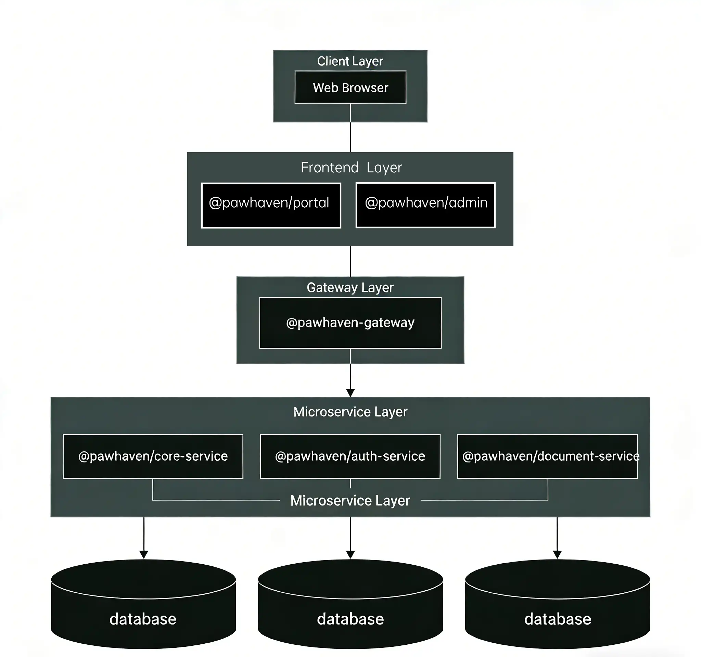

# Overview

## Part 1: Project & Architecture

### What is PawHaven?

PawHaven is an open-source platform aimed at supporting collaboration for animal rescue activities.  
The goal is to help people contribute to rescuing and caring for stray animals through structured digital tools.

### Architectural Overview

<p align="center">
  
</p>

PawHaven follows a layered, service-oriented architecture:

- **Client Layer**: Users interact through web-based applications.
- **Frontend Layer**: Dedicated applications for different user roles.
- **Gateway Layer**: Centralized request routing and boundary control.
- **Microservice Layer**: Independently deployable services, each owning its domain logic and data.
- **Data Isolation**: Each microservice maintains its own database, ensuring domain boundaries and reducing coupling.

**Architecture Principles**:

- ✅ **Microservice Independence**: Each service deployable independently; Gateway handles routing.
- ✅ **Strict Boundary Enforcement**: Frontend apps consume only frontend packages; backend services communicate only via Gateway APIs.
- ✅ **Shared Layer Discipline**: `shared` contains only types, constants, and pure functions—zero runtime logic.

---

## Part 2: Monorepo & Engineering Practices

### Monorepo Structure

```
pawhaven-monorepo/
├── apps/
│   ├── frontend/
│   │   ├── portal/
│   │   └── admin/
│   └── backend/
│       ├── gateway/
│       ├── core-service/
│       ├── auth-service/
│       └── document-service/
├── packages/
│   ├── frontend-core/
│   ├── backend-core/
│   ├── design-system/
│   ├── i18n/
│   ├── ui/
│   └── shared/
└── libs/
    ├── eslint-config/
    └── tsconfig/
```

- `portal`: Front-end portal application for general users.
- `admin`: Front-end admin dashboard for administrators.
- `gateway`: Back-end gateway service responsible for request routing and boundary control.
- `core-service`: Core back-end service handling main business logic.
- `auth-service`: Authentication and authorization service.
- `document-service`: Document processing service, e.g., PDF generation or file storage.

### 📦 Shared Packages Overview

| Package         | Used By                                                       | Purpose                                                                                         |
| --------------- | ------------------------------------------------------------- | ----------------------------------------------------------------------------------------------- |
| `shared`        | All frontend apps, all backend apps, all other packages       | Single source of truth for types, constants, pure utilities; enables cross-boundary type safety |
| `frontend-core` | `portal`, `admin`                                             | Framework-agnostic frontend logic layer; isolates business logic from UI                        |
| `design-system` | `portal`, `admin`                                             | Ensures visual consistency; contains design tokens, not implementation                          |
| `i18n`          | `portal`, `admin`                                             | Centralized translation management; supports runtime language switching                         |
| `ui`            | `portal`, `admin`                                             | Production-ready component library; built on `design-system` tokens                             |
| `backend-core`  | `gateway`, `core-service`, `auth-service`, `document-service` | Infrastructure abstraction; standardizes logging, DB access, error handling across services     |

### 🔧 Shared Libraries Overview

| Library         | Used By                | Purpose                                                                 |
| --------------- | ---------------------- | ----------------------------------------------------------------------- |
| `eslint-config` | All apps, all packages | Unified code quality enforcement; prevents style drift across teams     |
| `tsconfig`      | All apps, all packages | Consistent TypeScript compilation; reduces config duplication and drift |

### Engineering Principles

- 🟢 **Monorepo + pnpm Workspace**: Enables type safety, dependency management, and code reuse.
- 🟢 **Shared Package Discipline**: Frontend and backend share only types, constants, and utilities, no runtime logic.
- 🟢 **UI & Design System**: Reusable components and design tokens for visual consistency.
- 🟢 **Backend Core**: Abstracts logging, DB access, and error handling to enforce uniform practices.
- 🟢 **Code Quality & Consistency**: ESLint and TSConfig enforce unified rules across the monorepo.
